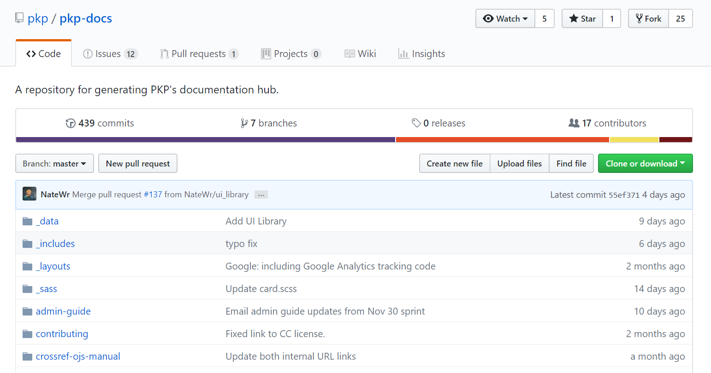
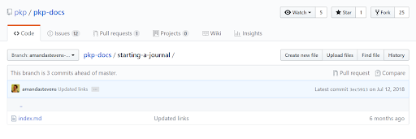
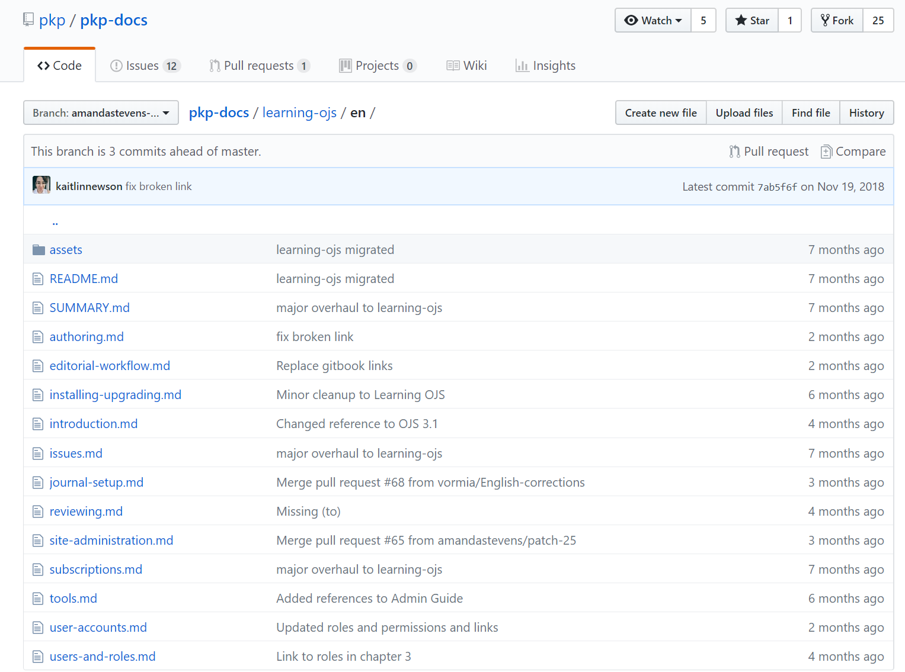
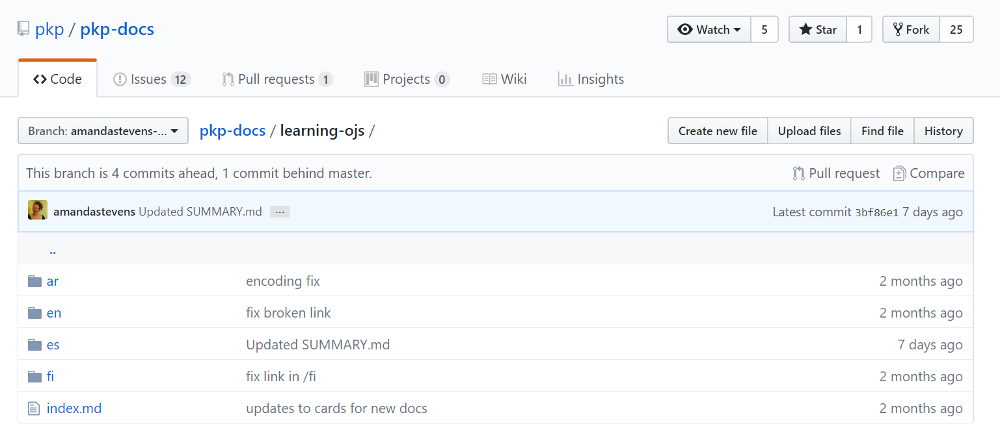
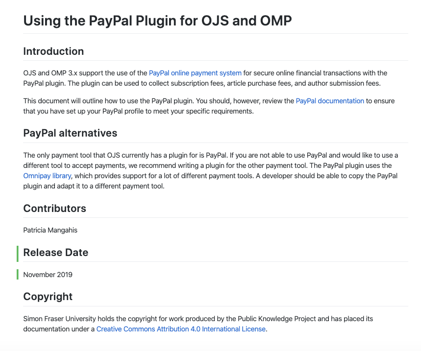

# Getting Started

Most of PKP’s documentation is hosted and managed in a GitHub repository called the PKP Documentation Hub and is built using an open-source tool called [Jekyll](https://jekyllrb.com/). GitHub is a collaborative version control system that manages and stores revisions of a project. To learn more about GitHub and Git, watch this ["What Is Git and Github?" video](https://www.youtube.com/watch?v=uUuTYDg9XoI) or this ["Git and Github for Poets" video](https://www.youtube.com/playlist?list=PLRqwX-V7Uu6ZF9C0YMKuns9sLDzK6zoiV).

The content files that make up PKP’s documentation are stored in the [Documentation Hub repository](https://github.com/pkp/pkp-docs) and anyone with a GitHub account can edit and add documents to the repository. This chapter explains the important things you will need to know when working on GitHub.

If you don’t have a GitHub account already, begin by [creating an account](https://github.com/join?source=header-home).

## File Structure

Each folder in the PKP Documentation Hub repository represents a document.



Short documents consist of a single markdown file and may have an “assets” folder of images. All content is contained in the `index.md` file and the table of contents on the side of the page is created using the header tags in markdown.



Longer documents consist of multiple chapter files, a README file, a SUMMARY file, and an assets folder. Content is stored in the chapter files and the README file acts as a summary page for the document. The SUMMARY file creates the table of contents.

**All files created will need to have a .md ending**



If the document exists (or will exist) in more than one language, there will be a separate folder of these files for each language version.



### README File

The README.md file should include a brief introduction regarding the document, a list of contributors, and a release date.



## Branches and Pull Requests

A branch is a version of the repository that contains the changes you’ve proposed, uniquely. Since it is not part of "main", it won’t have an impact on the way the site is built in real-time.

As most users will not have direct access to make changes to the PKP repository, they will need to create a branch to make changes. If you do not have full permission you will come across the message box that says: "You're editing a file in a project you don't have write access to. Submitting a change to this file will write it to a new branch in your fork, so you can send a pull request".


A branch can be created on your own repository or automatically generated when you try to make a change on the PKP repository.

## File Naming Conventions

**In General** While any name you create should work, it’s best to keep titles short and descriptive. Always replace spaces between words with a dash.

**Titles**: Some example titles include: `learning-ojs`, `pkp-theming-guide`, `crossref-ojs-manual`. Remember that titles are part of the file path in the URL to individual docs so keep it simple.

**Chapters**:  You might be tempted to number chapters, but if we ever need to create new chapters in between existing ones, we would need to re-number. It’s best to keep chapters in the same style as title-level names. Some examples for chapters include: `getting-started.md`, `troubleshooting.md`, `data-import-and-export.md`.

**Images**: Store all images in a single "assets" folder within the language you’re working (e.g.: `en/assets/`). Keep your image titles brief or with abbreviations and consistently named, so they’re easy to locate. Depending on how many images you have, numbering these might be a lot more convenient while working on the document. Listen to your heart. Some examples include: `contrib-01.png`, `authoring-images-01.png`. If you’re putting all your images into only the asset folder, it’s a good idea to name your images to correspond with chapter titles.

Note that file names are case sensitive, so if the image is saved as `learning-ojs3.1-jm-settings-workflow-email-templates.png` and you reference `learning-ojs3.1-jm-settings-workflow-email-templates.png` in the document, the image will not display.

## Markdown

The files are all in a format called Markdown, a simple, easy-to-read, easy-to-write text format that allows users to generate basic HTML without knowing HTML itself. It uses simple tags to format text on a website.

This is an example of markdown:

```
## The "Documentation Hub"

### Single Page Docs
```

Here are three guides for writing markdown:

- [Daring Fireball Markdown Syntax](https://daringfireball.net/projects/markdown/syntax)
- [Mastering GitHub Flavoured Markdown](https://guides.github.com/features/mastering-markdown/)
- [Markdown Cheatsheet](https://github.com/adam-p/markdown-here/wiki/Markdown-Cheatsheet)

## Editing with GitHub Desktop and Atom

If you're working on a large piece of documentation and you're not comfortable using either the command line or the web interface for GitHub, consider using [GitHub Desktop](https://desktop.github.com/) and the [Atom](https://atom.io/) text editor. With this workflow, you can "clone" a copy of the docs repository to your computer, make your edits locally (and even build a version of the Documentation Hub using Ruby, if you like) and create a pull request with your changes once you're finished.

Once you've installed GitHub desktop, you should have an option while viewing any GitHub repository to "Clone or Download" and "Open in Desktop".

1. Navigate to the repository you want to clone.
2. Click on the green button on the right that says "Clone or Download."
3. Select the "Open in Desktop" option.


GitHub desktop manages your commits and pull-requests locally. It's especially convenient if you're changing more than one file at once. If you have Atom installed, you can open your project with the editor directly from GitHub desktop.

1. Open GitHub desktop.
2. Right click on the name of the repository in which you want to work.
3. Select "Open in Atom."


In Atom, the repository directory structure is accessible on the left-hand side in the "project window." Clicking on any title opens it in the editor and allow you to make changes. You'll notice labels next to the files as you work. Green indicates a new file you've added. Yellow indicates a file you've changed since the last time you pulled an update from the primary repository.


If you are working on a project over time, you may want to regularly pull changes "from origin." You can do this in GitHub desktop by clicking on the "pull from origin" button near the top right of the window. It pulls changes since the last time you pulled them (or, since the time you cloned initially).

Once you make your edits with Atom and have a document you want to submit, you'll want to contribute it back as a "branch."

1. In GitHub desktop, click on the "Current Branch" button.
2. Click "New Branch"
3. Write a concise name for your branch based on the doc you're submitting, with a single dash between words.
4. Click "Create Branch."


Now that you've made your edits/additions and created your branch, you can _commit_ your code. On the left side of your GitHub desktop window, you should see all the files you're adding or changing and, at the bottom, a _commit_ option.


The first field is for a very short descriptor of what you just changed. A few words should do the trick. Here are some examples:

- Updated `filename.md`
- Migrated `filename.md`
- Added appendix to document
- Replaced images

The second field is for a more detailed description of what you changed. You might want to do this if you need to justify your changes or need to let everyone else know that a change is significant.

When you finish, click the button on the bottom left labelled "Commit to `branch name`."

Now that you've committed your changes, you can push your changes back to the repo with the button on the top right. It should say "Publish your Branch to GitHub" if it's the first time you've committed that branch. It syncs versions locally and remotely with your branch changes and submits your "pull request" to managers of the Docs Hub.

This document is, necessarily, a brief introduction to using GitHub. GitHub has a tremendous amount of documentation on its use, however. If you want to read more about GitHub basics, read ["Hello, World"](https://guides.github.com/activities/hello-world/).

<!---
Include this in internal Documentation Procedures instead
## Modify cards and site layout

Please read [Orientation to file structure](./README.md#orientation-to-file-structure) for guidance on how to configure the layout of the documentation hub. It is recommended that edits in this space be cleared via Git Issue or pull request.
--->

## Contribute in Other Formats

We encourage users and community members to write and edit documentation in markdown and contribute through GitHub. However, contributed documentation can be created or edited in any format you want to work in, including a .doc or .odt text document, a Google doc, or an email, and the DIG will convert the documentation to markdown. Do not contribute documentation in PDF, HTML, or LaTeX format.

Some contributors prefer to create or edit documentation in a Word, Open Document, Google Doc, or another format. If you’re creating documentation with a group of people, it can be easier to use a Google Doc than GitHub.

If you have created documentation in one of these other formats, you can email the file as an attachment or link to a shared document to documentation@publicknowledgeproject.org. If you created documentation as a Google doc, you should send the link in an email message.

If you are editing an existing document, try to make it as clear as possible what you have changed.
