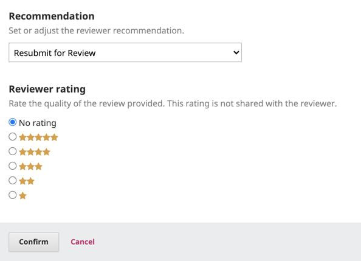
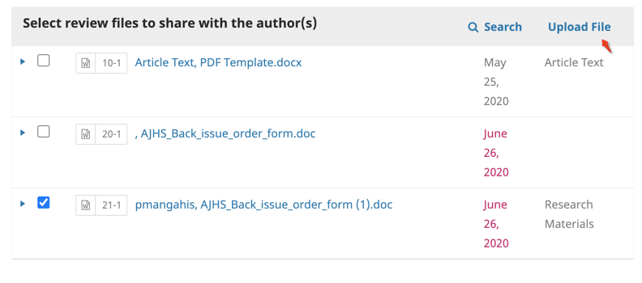

# Editorial Workflow

## Can a reviewer change a recommendation they already submitted?

Once a recommendation has been submitted by a reviewer, the review is essentially closed. A reviewer will not be able to make this change on their own. However, an editor (or section editor) can change the reviewer recommendation on their behalf.

To make the recommendation change, the Editor will need to click the blue arrow beside the reviewer's name followed by **Review Details**.

Change the recommendation on the drop down menu and click Confirm.

## How can a reviewer upload an attachment after the review has been submitted?

Once a review has been submitted, the review is essentially closed. The review file cannot be replaced with a new one by the reviewer. However, the editor can provide the author with the most recent version when sending the decision email.

To do this, the editor can upload a new attachment to their decision email.

## How do I cancel a new review round that was accidentally opened?

If an editor opens a new round of review before the previous round was completed, there is no way to cancel or reverse it, other than through editing the database, which we caution against since it compromises the editorial history of the submission. Reviewers invited to the previous round will not be able to access the previous round once the new round is open. The editors will need to ignore the previous round and continue working in the new round, completing the reviews and recording an editorial decision in the new round. There is no minimum or maximum number of reviewers required for each round. We recommend that the editor add a note in the submission that explains the situation.

## I’m an editor so why can’t I record an editorial decision?

It’s most likely that when you assigned yourself or were assigned by another editor, the assignment privilege checkbox was set to only allow you to recommend a decision. If this happens on a self-assignment (or if you have the global permissions of a journal editor/manager), simply navigate to the list of Participants, click on the blue triangle next to your name, and click Edit. Make sure the checkbox limiting assignment privileges is unchecked.

You can also unassign and re-assign yourself as the editor, being careful not to accidentally check this box again.

Once you do this, you should be able to record a decision. If you cannot change your own assignment privileges, ask the person who assigned you to do this. If this happens for another editor, you can either record the decision on their behalf or edit their privilege.

## How can I change the wording of reviewer recommendations?

It is not possible to customize the Reviewer recommendations through OJS or OMP configuration settings. There is an open [GitHub ticket](https://github.com/pkp/pkp-lib/issues/1660) to improve this functionality for future releases.

You can, however, use the [Custom Locale plugin](https://github.com/pkp/customLocale) to make minor wording changes of the Reviewer recommendation options. For example, you could change “Accept” to “Accept with minor changes.”  The Custom Locale Plugin offers an alternative to modifying the files on your server, by allowing you to set journal-by-journal overrides for locale key translations. Instructions on how to use the Custom Locale Plugin are available in the [PKP Translating Guide](https://docs.pkp.sfu.ca/translating-guide/en/customize-locale).

You cannot delete or add recommendations with the Custom Locale Plugin.

## Why did a user not receive a notification about a submission?

You can access a log of all events and emails sent on a particular submission by opening the submission and clicking “Activity Log” (or “Editorial History” in older versions of OJS and OMP).

If the Activity Log shows the message was sent but the user did not receive it, send test emails to determine whether the issue is specific to a user, submission, or action.

For further email troubleshooting, see the [PKP Administrator’s Guide](https://docs.pkp.sfu.ca/admin-guide/en/email).

## How do I make the galley file links appear in the issue table of contents?

First, ensure that the galley file is uploaded into the correct location. Only files uploaded under the “Publication” tab will be displayed to the end-reader.

Whether or not the galley file links appear on the issue table of contents page depends on which component type the galley file is and how the component type has been configured. If the link is not appearing on the table of contents, it is probably because it is a component type that has been configured as Dependent or Supplementary.

See the [Production and Publication chapter](https://docs.pkp.sfu.ca/learning-ojs/en/production-publication#galley-file-component-types) and [Workflow Settings chapter](https://docs.pkp.sfu.ca/learning-ojs/en/settings-workflow#components) in Learning OJS 3 for instructions on how to edit and configure component types so the galley file link will appear in the table of contents.

## Why are the HTML galley files not being displayed or identified properly?

If the HTML galley is triggering a download, instead of displaying in the browser window, double check that the HTML Article Galley plugin is active. Go to **Settings > Website > Plugins**, and ensure that the **HTML Article Galley** plugin is installed, up-to-date, and enabled.

When you upload a galley file, it’s important that you give it the generic label “html,” “pdf,” “xml,” etc. If your HTML file or another galley file is not being displayed properly, it could be because you gave it a different label. This causes the server to incorrectly identify your HTML file as something other than HTML.

To check the label on the galley file:

1. Go to the Submissions dashboard and find the submission under the All Active or Archives tab, depending on whether it has been published
2. Open the submission
3. Go to the Publication tab and Galleys
4. Check that the files listed there have been labelled correctly

If a galley file label needs to be changed and the article has already been published (and you’re using OJS 3.2+), you will need to un-publish it, change the label, and then re-publish it. If it has not been published yet or you are using an earlier version of OJS, you can go ahead and change the label.

See [our documentation about versioning](https://docs.pkp.sfu.ca/learning-ojs/en/production-publication#versioning-of-articles) for information about editing a published article.

See [our documentation about production and publication](https://docs.pkp.sfu.ca/learning-ojs/en/production-publication#edit-galley-files) for instructions on how to edit a galley file label.

If you have further issues, ask your Systems Administrator to check your server and filetype configurations. OJS, OMP, and OPS use three methods to determine a filetype, in the following order:

- PHP's `mime_content_type` function, which uses your system's magic.mime file (this method is deprecated)
- PHP's `finfo_...` suite of functions (which replaces `mime_content_type` as the preferred method)
- The external "file" tool, by executing the following: `file -bi [filename here]`

Problems may occur if:

- you are using the first option but your magic.mime file does not include enough information on the filetype you are attempting to identify;
- your server configuration does not support the first two options;
- you do not have sufficient permissions to run an external tool as in the third

Additionally, you may be encountering problems due to malformed files. If you are having trouble having your HTML files recognized, you may want to run them through [HTML-Tidy](http://www.w3.org/People/Raggett/tidy/) or otherwise ensure that they are valid HTML. HTML files created by word processors in particular may have a hard time being recognized as HTML.

You may also want to [search the forums](https://forum.pkp.sfu.ca/search?q=magic%20mime) for the keywords "magic mime" or for "mimetype" -- many users have had this problem, and there are several discussions on how to solve it.
See also [this forum article](http://forum.pkp.sfu.ca/t/error-message-on-upload-no-file-uploaded-or-invalid-file-type/29606).

## How do I delete an article from OJS?

To delete an article, you need to do the following:

- Login as the Journal Editor or Journal Manager
- Find the article record on the submissions page
- Click the down arrow key beside the manuscript title to reveal additional options
- Click delete, a pop box will appear confirming you deletion

Note: Be cautious when deleting published items from your site. Once items are published, they become part of the “scholarly record.” Users may have found the work, downloaded it, and cited it. Removing the item after publication interrupts the flow of information that scholars rely on to do further research on a subject. If a user asks for an item to be removed, be sure to verify the reason for the removal and explore alternatives before removing the item completely. Where possible, preserve some of the item metadata, such as the title, author name, and abstract, and include a note that the item has been removed so that users can see that the item existed at one time.

## How do I disable submissions for my journal or press?

You may want to disable submissions if your journal is no longer publishing or you only use OJS to publish your content.

To disable new submissions to the journal, you will need to be in the Journal Manager role. You can do this by restricting section submitters, as described in the [Learning OJS 3 guide: Journal Settings > Sections](https://docs.pkp.sfu.ca/learning-ojs/en/journal-setup#restrict-section-submitters).

There is an [open issue](https://github.com/pkp/pkp-lib/issues/5702) to improve the ability to close and control submissions that is scheduled for release in OJS/OMP/OPS 3.3.
