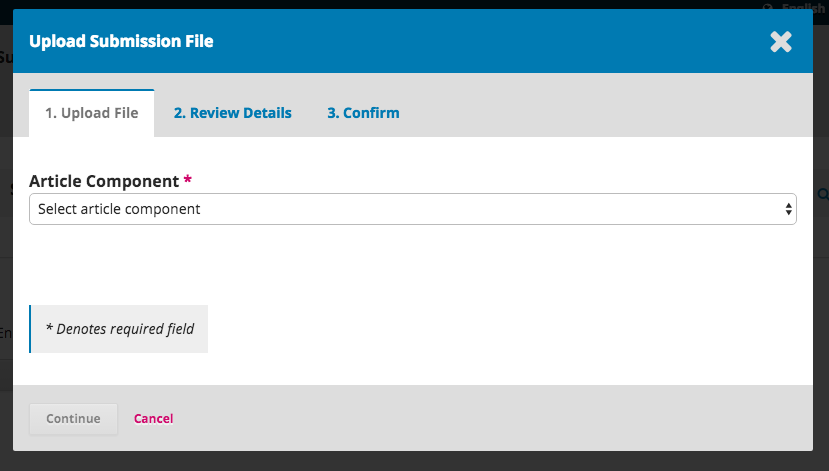
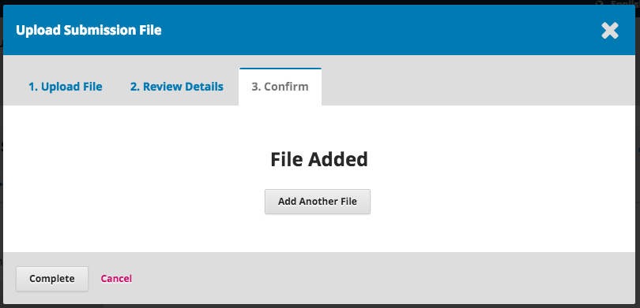
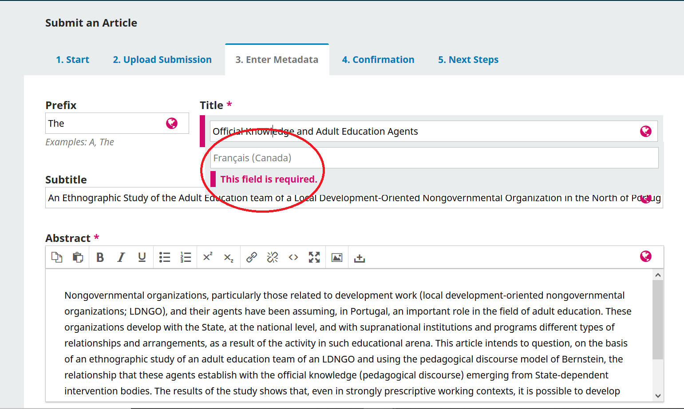
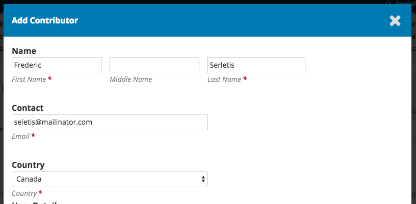
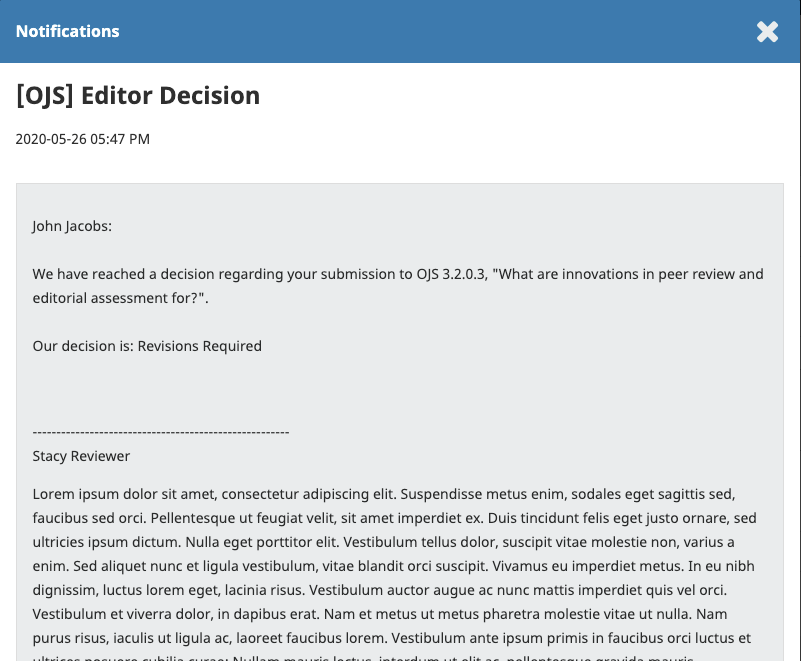
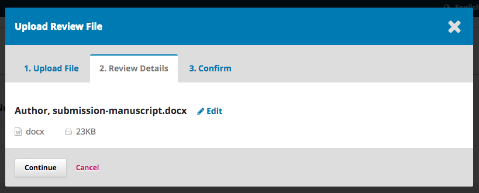
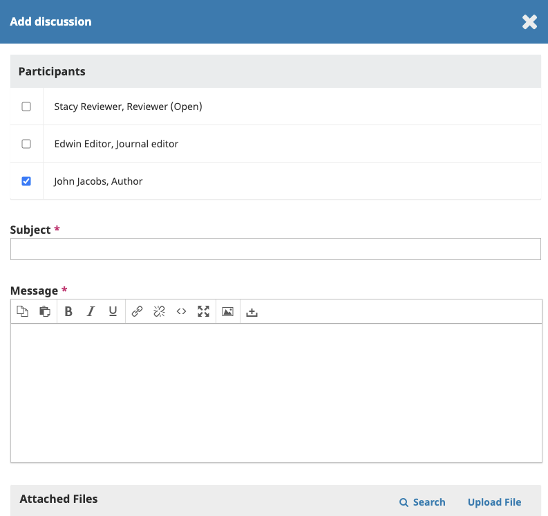
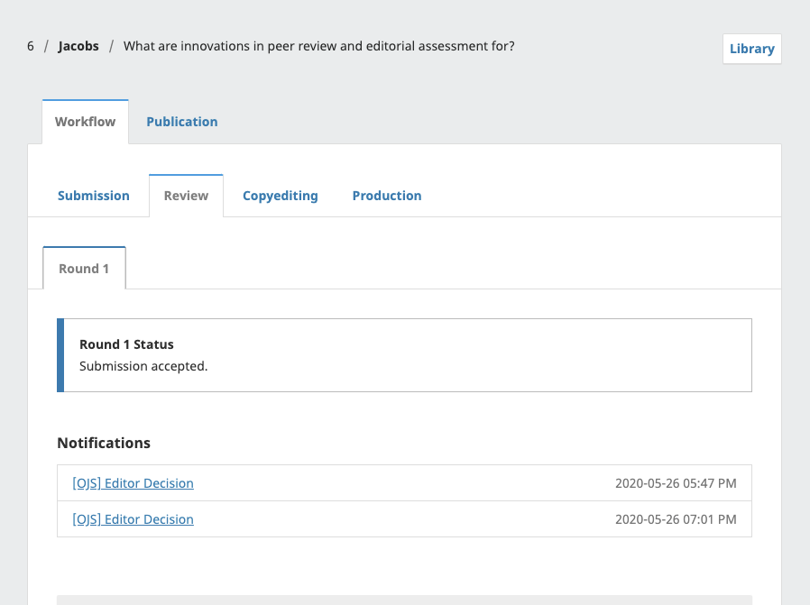
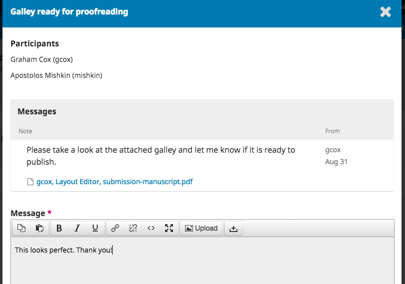

# Autores

En este capítulo, aprenderá cómo trabaja un autor en OJS 3.2 desde el registro hasta la revisión de la galerada final.

## Registrándose en la revista

Para realizar un envío a una revista en OJS 3, primero tendrá que registrar una cuenta de usuario en una revista e iniciar sesión \(vea [Registrándose en una revista](./user-accounts#registering-with-a-journal)\). Tras esto, cuando inicie sesión, será llevado a su Panel de Control.

Actualmente está vacío, ya que aún no ha realizado envíos.

## Enviar un artículo

Comience un nuevo envío haciendo clic en el botón **Nuevo envío** al lado derecho de la pantalla. Se le llevará al paso 1 de un proceso de 5 pasos para subir y describir su envío.

### Paso 1

En el **Paso 1** proporcionará información preliminar sobre su envío.

Si la revista permite envíos en varios idiomas, puede seleccionar el idioma de su envío en el menú desplegable. Los idiomas pueden activarse en la configuración del sitio web -> Configuración -> Idioma.

Seleccione la sección apropiada para su envío \(artículo, revisión, etc.\). Si no está seguro de qué sección es la apropiada, haga la mejor conjetura posible.

Lea y acepte las declaraciones en la lista de verificación de envíos marcando cada casilla. Incluya cualquier comentario para el editor, lea la declaración de privacidad de la revista, y luego haga clic en el botón **Guardar y Continuar** para moverse al **Paso 2**.

### Paso 2

En el **Paso 2** se le abrirá una ventana que le permitirá subir su archivo.

Primero, DEBE seleccionar un componente de artículo. Esto permite que el sistema sepa si el archivo es el propio manuscrito, una imagen, un conjunto de datos, etc. **Esto debe ser seleccionado antes de que el archivo se suba**.

Una vez hecha esta selección, puede subir su primer archivo. Es importante tener en cuenta que solo puede subir **un único** archivo a la vez. Los archivos adicionales pueden ser subidos más tarde durante el proceso. Por lo general, este primer archivo será el cuerpo de su manuscrito. Haga clic en el botón **Continuar** una vez que el archivo suba.

Después de subir el archivo, se le pedirá que revise el nombre del archivo. Utilice el enlace Editar para realizar cualquier cambio.

Haga clic en el botón **Continuar**.

A continuación, tiene la opción de repetir el proceso para subir archivos adicionales \(p. ej. un conjunto de datos o una imagen\).

Una vez que haya terminado de subir todos sus archivos, haga clic en **Completar**; esto cerrará la ventana de subida de archivos.

Será redirigido a la pantalla _Enviar un artículo_, donde verá los archivos que ha subido. Si necesita realizar cambios, expanda la flecha azul a la izquierda de su archivo y haga cualquier cambio usando el enlace _Editar_.

Haga clic en 'Guardar y continuar' para ir al Paso 3.

### Paso 3

En el **Paso 3**se le pedirá que añada más información sobre el envío, incluyendo el título del envío (desglosado en prefijo, título y subtítulo) y el resumen. Si la revista permite envíos en varios idiomas, haciendo clic en los campos de metadatos revelará la opción de introducir los metadatos en otros idiomas previamente habilitados, permitiéndole introducir el título, subtítulo y resumen en el otro idioma(s).  Desplazándose hacia abajo...

...puede agregar cualquier colaborador adicional.

Puede añadir más colaboradores \(p.ej. coautores\), haciendo clic en el enlace **Añadir colaboradores**. Esto abrirá una nueva ventana con campos para introducir sus datos.

Presione **Guardar** y el nuevo colaborador aparecerá en la pantalla.

Si las categorías están habilitadas en la revista a la que está realizando un envío, podrá seleccionar una categoría para el manuscrito, si aplica.

También puede ver campos adicionales para rellenar, tales como palabras clave. Si hay idiomas adicionales habilitados en la revista, puede introducir los metadatos en esos idiomas. Al hacer clic en el campo del metadato se mostrarán los campos para otros idiomas habilitados en la revista.

Para introducir una palabra clave, simplemente escriba la palabra o frase y pulse su tecla Intro. La palabra o frase será formateada como palabra clave.

Haga clic en **Guardar y continuar** para avanzar.

### Paso 4

En el paso 4, se le pedirá que confirme que está satisfecho con su envío.

Haga clic en **Finalizar envío**.

Aparecerá una caja que te pedirá que confirmes que has finalizado. Haga clic en **OK**.

### Paso 5

¡Su envío ha sido completado! El editor ha sido notificado de su envío. En este punto, puedes seguir los enlaces para:

* Revisar este envío
* Crear un nuevo envío
* Regresar al panel de control

Una vez que complete un envío, no podrá realizar cambios en el mismo.  Si desea reemplazar el archivo que ha enviado o hacer otros cambios al envío, necesitará ponerse en contacto con el editor a través de la herramienta Discusiones.

### Panel de control

Y aquí está su envío en su Panel de Control. Puede ver que actualmente está en la etapa de _Envío_.

En los próximos días, pasará a la fase de Revisión y, si se acepta, a las fases de Corrección y Producción antes de ser publicadas.

## Editing Metadata

In OJS 3.2, you may edit your own metadata at different stages of the editorial workflow. This will be dependent on settings granted by the Journal. You may either have global permission to make edits or have to send a request to the Editor to do so.

Changes might include updated abstracts, correcting spelling errors, or adding additional contributors.

To make edits to your submitted manuscript, click on the publication tab of your submission.

You will be able to make changes to any of the sub-menus on the left by clicking to those tabs. If multiple languages are enabled for the journal, you will be able to edit metadata in those languages by clicking on the language tab in the top right. Click ‘Save’ once you’re done making your changes.

When granted permission, you will be able to make changes to the following sections on the Publication tab: Title & Abstract, Contributors, and Metadata. While Galleys is listed as an option on the side menu, you will not be able to upload or make changes in this section.

If you notice that the ‘Save’ button is grey and inactive, this means you will have to request permission from the Editor to make changes to your submission or ask them to make the changes for you.

## Responding to a Review

Once the review process has completed, you will be notified via email by the editor of their decision.

After receiving the email with the decision, login to your dashboard. Select the manuscript you have been notified about.

Within the Review tab of the manuscript, you will also see a copy of the Editorial Decision under Notifications. Depending on the type of peer review the journal uses, you may see less information on the Review tab of the journal. The example below shows an open peer review which allows authors to see who the reviewer was.

To view the Editorial decision, click the link under notifications.

Based on the information in the editor's message, you must now prepare your revisions.

### Uploading the Revised File

Once you’re ready to upload the revised file, scroll down the page and find the panel for **Revisions**.

Use the *Upload a File* link to upload your revised manuscript.

Use the dropdown menu to choose that you are uploading a revision of an existing file.

Then upload the revised file and hit **Continue**.

Check the file details and hit **Continue** again.

If you have any additional files to upload, do so now. Otherwise, hit **Complete**.

Your revised file is now visible in the Revisions panel.

### Inform the Editor

The editor will receive a notification about the new file(s) being uploaded. Additionally you can inform the editor via the Review Discussion panel as explained below.

From there, select the *Add Discussion* link.

Select the users you want to notify under Participants.

Add a subject line and a message.

Hit **OK** to send the message.

An email has now been sent to the editor and you (and the editor) can see the message in the Review Discussions panel.

At this point, the author needs to wait to hear back from the editor as to whether the revisions are acceptable.

### Revisions Accepted

You will receive an email that your revisions have been accepted.

In addition, notifications will appear on your dashboard.

The notifications show up in order of date, meaning the most recent one will be on the bottom. Click on it to open the message (which is the same as the email you would have also received).

Use the **X** in the upper right corner to close the window.

Further down your dashboard, you will also see a discussion reply from the editor.

Clicking the discussion title will open it up.

Congratulations! You've been accepted and your submission file is moving on to the Copyedit stage.

## Resubmitting for Review

If the editor’s decision is to resubmit for review, you will need to log in and select the article in your submissions page. The resubmission is done in the review stage, there is no need to start a new submission.

At the review stage you will need to do two things to resubmit once you have revised your document:

Upload the new file in the revisions section. To upload a new file click on ‘Upload file.’ A new window will open allowing you to upload your file(s). Select the appropriate option from the dropdown menu to indicate you are submitting a revision of an existing file.

Add a discussion to notify the editor that you have re-submitted.

The peer review process will be repeated, and you will likely receive additional revisions to make. Once these are completed and accepted, you will then be moved to the next stage.

## Responding to a Copyediting Request

The next step in the workflow is to inspect your submission files that have been copyedited.

You will receive an email indicating that files are available. To see them, login to the journal and go to your dashboard.

You can see your entry in the My Authored panel. Select the Copyediting link to go to the full submission record, including the notification in the Copyediting Discussions panel.

Click on the linked discussion to open it, read the message, and open the attached file.

Once you have read the attached file, you can respond to the copyeditor indicating any required changes or your approval.

If needed, you could attach a revision, but for this example we will simply approve the changes and hit **OK**.

On your dashboard, you can see that you were the last person to reply to the message.

Your role in the copyediting process is now complete and you can wait for the request to proofread the final galleys (e.g., PDFs, HTML, etc.) before publication.

## Responding to a Proofreading Request

The next step in the workflow is to inspect your submission files that have been converted into galleys (e.g., PDF, HTML, etc.).

You will receive an email indicating that files are available. To see them, login to the journal and go to your dashboard.

You can see your entry in the My Authored panel. Select the Production link to go to the full submission record, including the notification in the Production Discussions panel.

Click on the linked discussion to open it, read the message, and open the attached file.

Once you have read the attached file, you can respond to the Layout Editor indicating any required changes or your approval.

That's it! Your role in the editorial workflow is now completed.
