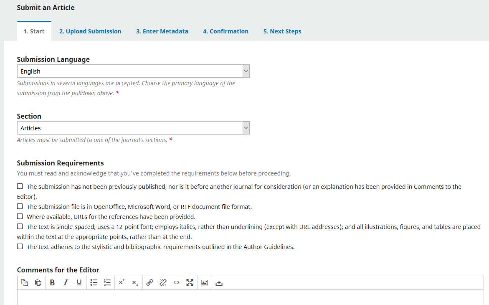
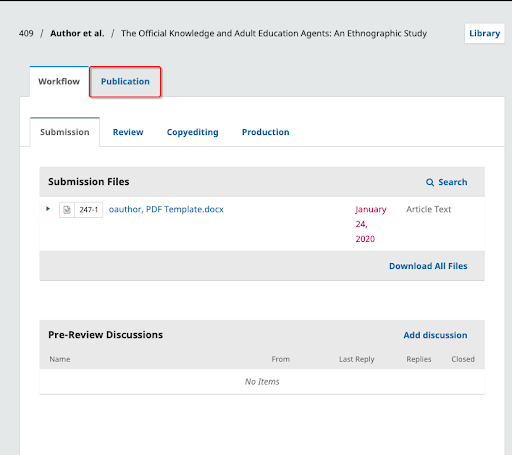
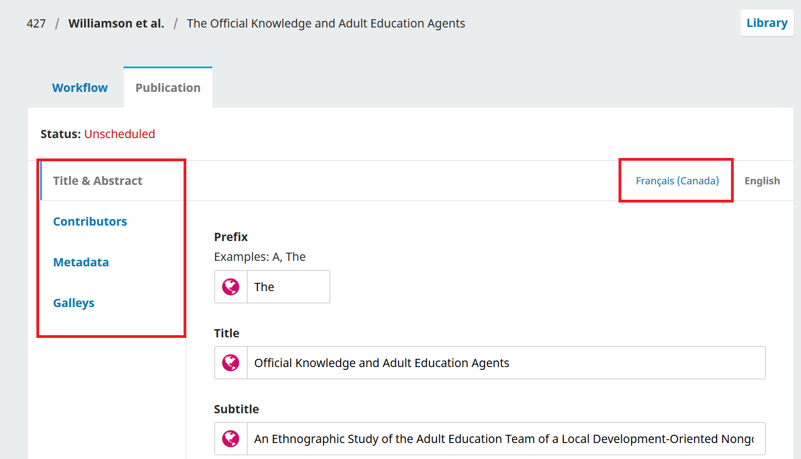

# Chapter 13: Authoring

In this chapter, you will learn about how an author works in OJS 3.2 from registration through to proofreading the final galley.

## Registering with the Journal

To make a submission to an OJS 3.2 journal, you will first need to register a user account with a journal and log in \(see [Registering with a Journal](./user-accounts#registering-with-a-journal)\). After that, when you login, you will be taken to your Dashboard.

It is currently empty as you have made no submissions.

## Submitting an Article

Start a new submission by clicking the **New Submission** button on the right side of the screen. You will be taken to Step 1 of a 5-Step process to upload and describe your submission.

### Step 1

In **Step 1** you will provide preliminary information about your submission.

If the journal allows submissions in multiple languages, you can select the language of your submission from the drop-down menu. Languages can be enabled in Website Settings -> Setup -> Language.

Select the appropriate section for your submission \(e.g., article, review, etc.\). If you aren’t sure which section is appropriate, make your best guess.

Read and agree to the statements in the submission checklist by checking each box. Include any comments for the editor, read the journal’s privacy statement, and then click the **Save and Continue** button to move to **Step 2**.

### Step 2

On **Step 2**, a window will open allowing you to upload your submission file.

First, you MUST select an Article Component. This lets the system know whether the file is the body of the manuscript, an image, a data set, etc. **This must be selected before your file will upload**.

Once you’ve made that selection, you can then upload your first file. It is important to note that you can only upload **one** file at a time. Additional files can be uploaded later in the process. Typically, this first file will be the body of your manuscript. Hit the **Continue** button once the file uploads.

After uploading the file, you will be asked to review the name of the file. Use the Edit link to make any changes.

Click the **Continue** button.

Next, you have the option to repeat the process to upload additional files \(e.g., a data set or an image\).

Once you have finished uploading all of your files, click **Complete**; this will close the upload window.

You will be brought back to the _Submit an Article_ screen where you will see the files you’ve uploaded. If you need to make changes, expand the blue arrow to the left of your file and make any changes using the _Edit_ link.

Click ‘Save and Continue’ to move to Step 3.

### Step 3

On **Step 3**, you will be asked to add more information about the submission, including the title of the submission \(broken down into prefix, title, and subtitle\), and the abstract. If the journal allows submissions in multiple languages, clicking on each metadata field will reveal the option to enter the metadata in the other languages that are enabled, allowing you to enter the title, subtitle and abstract in the other language(s).  Scrolling down...

...you are able to add any additional contributors.

You can add more contributors \(e.g., co-authors\), by clicking the **Add Contributors** link. This will open a new window with fields to enter their information.

Hit **Save**, and the new contributor will appear on the screen.

If the categories are enabled in the journal you are submitting to, you will be able to select a category for the manuscript submission, if it applies.

You may also see additional fields to complete, such as keywords. If additional languages are enabled for the journal, you can enter the metadata in these languages. Clicking on the metadata field will reveal the fields for other languages enabled in the journal.

To enter keyword, simply type the word or phrase and hit your Enter key. The word or phrase will be formatted as a keyword.

Click **Save and Continue** to move forward.

### Step 4

On Step 4, you will be asked to confirm that you are happy with your submission.

Click **Finish Submission**.

A box will pop up asking you to confirm you are finished. Click **OK**.

### Step 5

Your submission is now complete! The editor has been notified of your submission. At this point, you can follow the links to:

* Review this submission
* Create a new submission
* Return to your dashboard

Once you complete a submission, you cannot make changes to it.  If you want to replace the file you submitted or make other changes to the submission, you will need to contact the editor through the Pre-Review Discussions tool.

### Dashboard

And here is your submission in your Dashboard. You can see that it is currently in the _Submission_ stage.

Over the coming days, it will move into the Review stage, and if accepted, into the Copyediting and Production stages before being published.

## Editing Metadata

In OJS 3.2, you may edit your own metadata at different stages of the editorial workflow. This will be dependent on settings granted by the Journal. You may either have global permission to make edits or have to send a request to the Editor to do so. 

Changes might include updated abstracts, correcting spelling errors, or adding additional contributors. 

To make edits to your submitted manuscript, click on the publication tab of your submission.

You will be able to make changes to any of the sub-menus on the left by clicking to those tabs. If multiple languages are enabled for the journal, you will be able to edit metadata in those languages by clicking on the language tab in the top right. Click ‘Save’ once you’re done making your changes.

When granted permission, you will be able to make changes to the following sections on the Publication tab: Title & Abstract, Contributors, and Metadata. While Galleys is listed as an option on the side menu, you will not be able to upload or make changes in this section. 

If you notice that the ‘Save’ button is grey and inactive, this means you will have to request permission from the Editor to make changes to your submission or ask them to make the changes for you. 

## Responding to a Review

Once the review process has completed, you will be notified via email by the editor of their decision.

After receiving the email, login to your dashboard.

Select the *Review* link next to your submission to view the decision.

From here, you can see the decision (revisions requested) and a link to the editor's notification.

Based on the information in the editor's message, you must now prepare your revisions.

### Uploading the Revised File

By scrolling down the page, you will find a panel for **Revisions**.

Use the *Upload a File* link to upload your revised manuscript.

Use the dropdown menu to choose that you are uploading a revision of an existing file.

Then upload the revised file and hit **Continue**.

Check the file details and hit **Continue** again.

If you have any additional files to upload, do so now. Otherwise, hit **Complete**.

Your revised file is now visible in the Revisions panel.

### Inform the Editor

The editor will receive a notification about the new file(s) being uploaded. Additionally you can inform the editor via the Review Discussion panel as explained below.

From there, select the *Add Discussion* link.

Use the *Add User* link to add the editor.

Add a subject line and a message.

Hit **OK** to send the message.

An email has now been sent to the editor and you (and the editor) can see the message in the Review Discussions panel.

At this point, the author needs to wait to hear back from the editor as to whether the revisions are acceptable.

### Revisions Accepted

You will receive an email that your revisions have been accepted.

In addition, notifications will appear on your dashboard.

The later notification is the current one. Click on it to open the message (which is the same as the email you would have also received).

Use the **X** in the upper right corner to close the window.

Further down your dashboard, you will also see a discussion reply from the editor.

Clicking the discussion title will open it up.

Congratulations! You've been accepted and your submission file is moving on to the Copyedit stage.

## Resubmitting for Review

If the editor’s decision is to resubmit for review, you will need to log in and select the article in your submissions page. The resubmission is done in the review stage, there is no need to start a new submission.

At the review stage you will need to do two things to resubmit once you have revised your document:

Upload the new file in the revisions section. To upload a new file click on ‘Upload file.’ A new window will open allowing you to upload your file(s). Select the appropriate option from the dropdown menu to indicate you are submitting a revision of an existing file.

Add a discussion to notify the editor that you have re-submitted.

The peer review process will be repeated, and you will likely receive additional revisions to make. Once these are completed and accepted, you will then be moved to the next stage.

## Responding to a Copyediting Request

The next step in the workflow is to inspect your submission files that have been copyedited.

You will receive an email indicating that files are available. To see them, login to the journal and go to your dashboard.

You can see your entry in the My Authored panel. Select the Copyediting link to go to the full submission record, including the notification in the Copyediting Discussions panel.

Click on the linked discussion to open it, read the message, and open the attached file.

Once you have read the attached file, you can respond to the copyeditor indicating any required changes or your approval.

If needed, you could attach a revision, but for this example we will simply approve the changes and hit **OK**.

On your dashboard, you can see that you were the last person to reply to the message.

Your role in the copyediting process is now complete and you can wait for the request to proofread the final galleys (e.g., PDFs, HTML, etc.) before publication.

## Responding to a Proofreading Request

The next step in the workflow is to inspect your submission files that have been converted into galleys (e.g., PDF, HTML, etc.).

You will receive an email indicating that files are available. To see them, login to the journal and go to your dashboard.

You can see your entry in the My Authored panel. Select the Production link to go to the full submission record, including the notification in the Production Discussions panel.

Click on the linked discussion to open it, read the message, and open the attached file.

Once you have read the attached file, you can respond to the Layout Editor indicating any required changes or your approval.

That's it! Your role in the editorial workflow is now completed.
