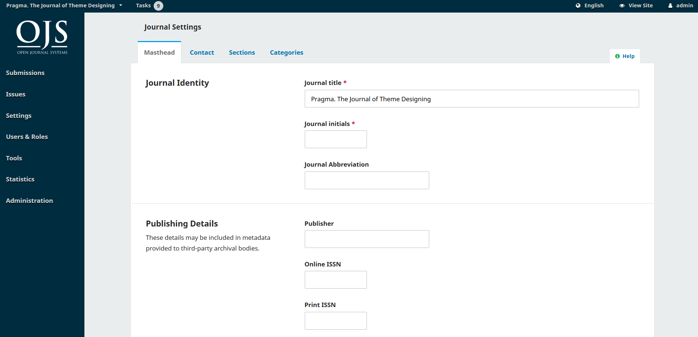
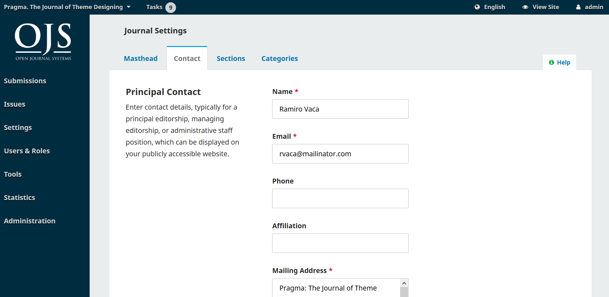
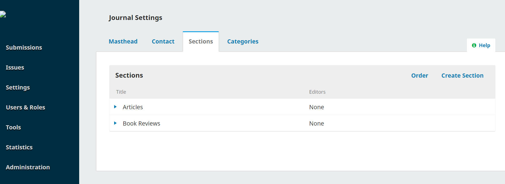
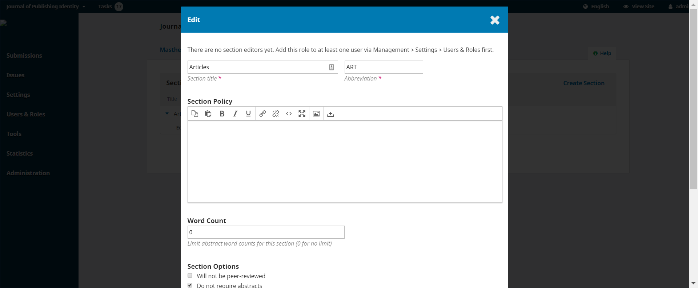
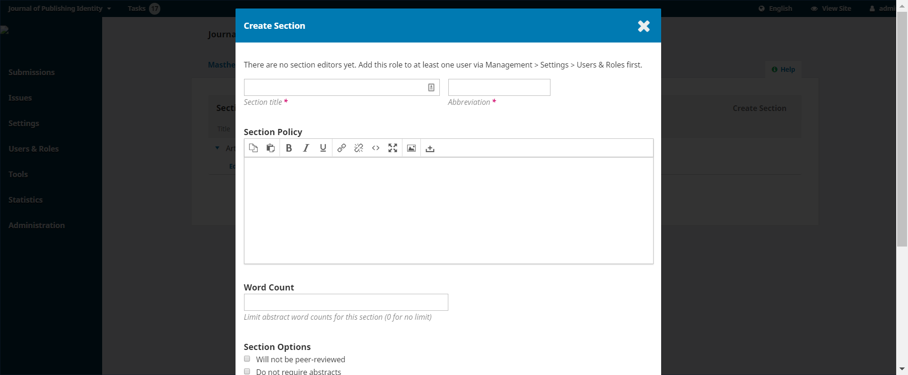
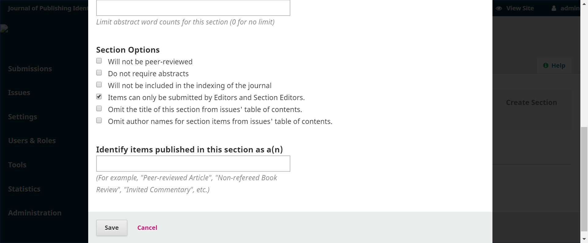
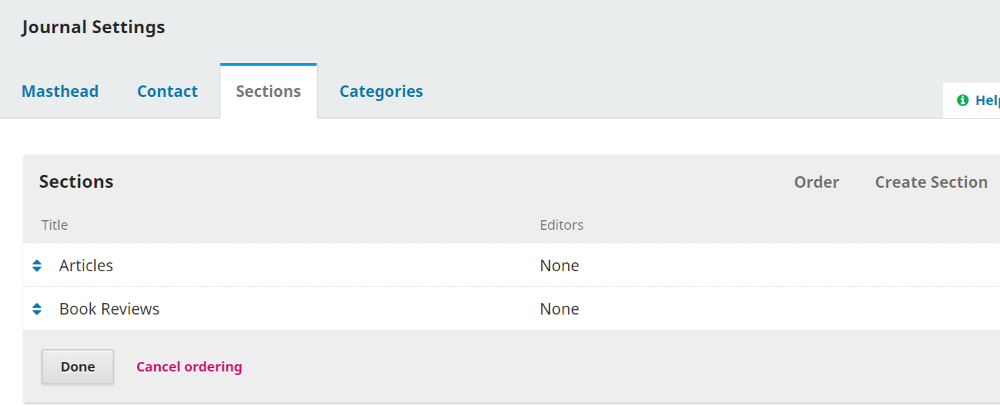

# Chapter 5: Journal Settings

The Settings section allows you to configure your OJS installation to best meet your publishing needs.

You can find the Settings in the left menu panel when you are logged in as a user with Journal Manager permissions.

It consists of Journal Settings, Website Settings, Workflow Settings, and Distribution Settings, which will be covered in the next 4 chapters.

The Journal Settings page includes details about the journal.

Use the tabs to navigate to the different sections of Journal Settings: Masthead, Contact, Sections.

## Masthead

**Journal title** is the name of your journal. E.g., Journal of Software Documentation

**Journal initials** are the initials of the journal. E.g., JSD.

**Journal Abbreviation** is the abbreviation of your journal name. E.g., JSoftDoc.

**Publisher** is the name of the organization publishing the journal.

Note that the publisher name entered here is used for metadata but will not be displayed on your site. To show the publisher name on your site you can enter it under Journal Settings > Contact > Mailing Address. You can also add it under About the Journal below.

**ISSN** \(International Standard Serial Number\) is an eight-digit number which identifies journals. It is managed by a world wide network of National Centres coordinated by an International Centre based in Paris, backed by Unesco and the French Government. A number can be obtained from the [ISSN web site](http://www.issn.org/). This can be done at any point in operating the journal.

OJS journals will typically have an online ISSN, but some may also publish a print version, which requires a different print ISSN.

Please note that the ISSN entered here is used for metadata but will not be displayed on your site. It's recommended that you also add the ISSN to the footer of your site. You can do this under Website Settings > Appearance > Footer.

**Journal Summary** is a brief description of your journal. If you are on an OJS installation with multiple journals, this text will appear with your journal listing. You can also choose to add the journal summary to the journal homepage in the Website Settings.

**Editorial Team** allows you to add the names of your editorial team or anyone else you wish to mention. This will appear on the public website under About &gt; Editorial Team.

**About the Journal** is a space to add any information about your journal which may be of interest to readers, authors, or reviewers.

This could include your open access policy, the focus and scope of the journal, copyright notice, sponsorship disclosure, history of the journal, a privacy statement, and inclusion in any LOCKSS or CLOCKSS archival system.

Hit the **Save** button to save your changes.

## Contact

Use this section to add journal contacts.

**Principal Contact**: Add contact information for the journal's main contact person, including name, email, phone, affiliation, and mailing address for the journal. This will appear on the journal's Contact page.

**Technical Support Contact**: Add contact information for the journal's technical support person. This information will appear on the journal's Contact page and also in different points in the workflow to offer assistance to users.

Hit the **Save** button to save your changes.

## Sections

Use this page to configure the different sections of your journal. E.g., Articles, Editorials, Reviews, Commentary, etc.

All of your existing sections will appear here. OJS requires at least one section, and creates an "Articles" section by default.

You can modify sections by clicking on the blue arrow to the left of the section name. This will reveal options to edit or delete the section.

### Edit a Section

Selecting the edit link will open a new window with different configuration options.

From here, you can change the name or abbreviation of the section.

**Section Policy**: Use this field to add important details such as submission requirements, peer review, etc.

**Word Count**: Use this to limit the number of words for abstracts in this section.

**Section Options**: Each section can have different settings, including whether it is indexed, peer-reviewed, accepts unsolicited submission, or listed in the table of contents. For example, an Editorial section will not typically be peer-reviewed.

**Identify items published in this section as a\(n\)**: This is used by some systems. Note that it is not a required field.

**Section Editors**: If you have editors enrolled in your journal, you will see them listed here and can assign one of them to the section. This means any submissions made to the section are automatically assigned to the editor, saving you from manually assigning an editor.

Hit the **Save** button to save your changes and return to the Sections page.

### Create Section

From the sections page, select the Create Section link to open a blank window, exactly the same as the window used for editing a section described above.

Fill in the details and hit Save to record your work.

### Restrict section submitters

Each section allows to restrict submissions by checking the "Items can only be submitted by Editors and Section Editors" checkbox.

If this checkbox is checked for all sections, authors will not be able to submit to the journals. Authors who select New Submission from their dashboards will now see the message "This journal is not accepting submissions at this time."

### Order Sections

When you have more than one section created, you will see an Order link. Use that to reorder how those sections display on your journal website.

Hit the **Done** button when you are finished.

## Categories
In OJS 3.1.2 you can create Categories to organize your articles into thematic collections and provide another way for readers to access your content. Categories can be displayed as a browse block on your journal site and readers can select a category to view all articles in that category. You can place an article in a category by editing its metadata, which is explained in the [Production section of the Editorial Settings chapter](./editorial-workflow.md#production). This section explains how to create and edit categories.

To create a new category:
* Click Add Category
* Enter a name for your category that will be displayed to readers
* Enter a path for the category’s URL on your site
* Enter a description which will appear above the list of articles in the category
* You can optionally change the order of the articles by date or title
* Optionally add an image which will appear at the top of the category’s page
* Click Save

To edit a category:
* Click the name of the category you want to edit
* Make the changes
* Click OK

To remove a category:
* Click the blue arrow next to the category you want to remove
* Click the Remove button that appears below
* Confirm that you want to remove the category

To display categories on your website you can go to Website Settings > Sidebar Management and place the Browse block on your sidebar.
