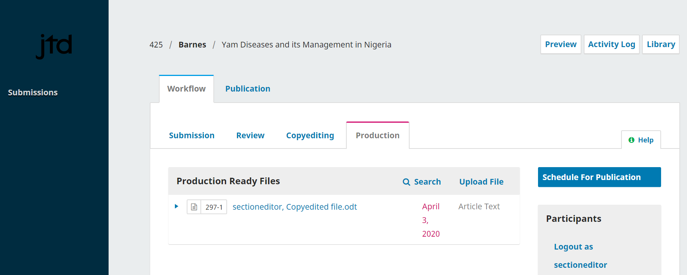
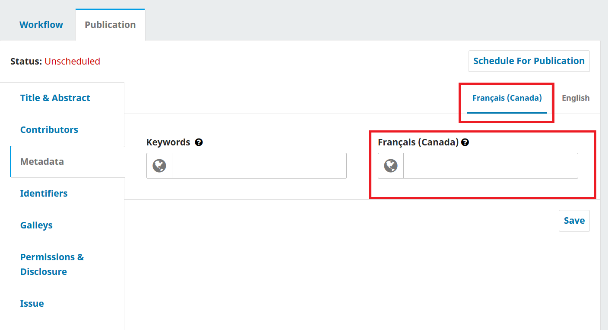

# Chapter 15: Production and Publication

With the completion of the Copyediting stage, the submission now moves to Production. From here, the copyedited files will be converted to publishable formats in the form of galley files (e.g., PDF, HTML) and proofread before publishing. A new journal issue will be created and the article will be scheduled for publication in the issue. This chapter explains the steps in that process, as well as how to use the versioning feature in OJS 3.2 to publish a new version of an article if significant changes are made. 

To start working in Production, the Section Editor or Journal Editor must login to the system and choose the submission from their dashboard.

Clicking on the article will open the submission record.

You will see the copyedited files are now available in the **Production Ready Files** panel. 

In the **Production** tab, you can assign participants (such as a Layout Editor) to the Production stage of the workflow and communicate with participants in the **Production Discussions** panel.

## Publication Tabs
Everything related to publishing a submission is done under the Publication tab. The Publication tab allows you to edit or add information about the submission, including contributors, metadata, and identifiers. It is also where you will upload the final Galley files for publication in the journal.

Here is an overview of what the different tabs in this section are for. Detailed instructions on some of these are available later in the chapter.

learning-ojs-3.2-production-publication-tab.png

**Title & Abstract**
Use this tab to edit the article title, subtitle, and abstract.

If any changes are made, click Save before exiting this window.

**Contributors**
Use this tab to add, edit, or remove article contributors.

**Metadata**
Use this tab to add or edit article keywords. 

If any changes are made, click Save before exiting this window.

**Identifiers**
Use the Identifiers tab to view or add a unique identifier, such as a DOI.

**Galleys**
Use the Galleys tab to upload the final file for publication. 

**Permissions & Disclosure**
Include details about the copyright holder and link to the article license, if applicable.

**Issues**
Use the Issues tab to assign the article to a journal issue.

### Multilingual submissions

The Title & Abstract, Metadata, Permissions & Disclosure, and Issue tabs have options for adding and editing metadata in multiple languages. Languages must first be turned on in Website Settings -> Setup -> Languages.

Select the desired language tab below the “Schedule for Production” button, and complete the metadata fields in the selected language. 

The “Issue” tab allows you to upload multiple cover images in selected languages.

## Formatting Article for Publication

### Assign Layout Editor
A notification banner indicates that you must assign someone to create the galley files (e.g., the PDFs, HTML, etc.) from the production ready files.

This can vary from journal to journal – you may have layout editors or production assistants to do this work. Some journals use an external graphic design or typesetting service. If you would like to communicate with your layout editor, production assistant, graphic designer, or typesetter through OJS and manage the production process with them in OJS, ensure they have a user account and add them as a participant to the submission. 

To make the assignment, use the **Asign** link in the Participants list. This will open a new window.

Use the role selector and search button to find appropriate users. Select the user and choose a predefined message, then click **OK** to send.

The user has now been notified via email and in the dashboard.

