# Flux des Travaux Éditoriaux

Dans ce chapitre, vous suivrez une soumission tout au long du flux des travaux, de la première soumission à la publication finale.

Le flux des travaux est divisé en 4 étapes:

**Soumission** : C'est là que les nouvelles soumissions arrivent tout en étant affectées aux Rédacteurs de Section et considérées pour le passage à l'étape de d'Évaluation.

Certaines soumissions sont clairement inappropriées et ne dépassent jamais ce stade.

**Évaluation** : c'est là que se déroule l'évaluation par les pairs, ainsi que toutes révisions requises par l'auteur.

Certaines soumissions ne passeront pas le stade d'évaluation et se termineront ici. Celles qui sont acceptées passent à l'étape suivante.

**Révision** : les articles acceptés passent à ce stade, où ils sont améliorés par le travail d'un-e Réviseur/euse. Les auteurs ont la possibilité de changer la copie suivant les modifcations apportées par le/la réviseur/euse.

**Production** : Une fois que les révisions sont terminées et approuvées, la soumission passe à ce stade. En production, les fichiers révisés sont convertis en d'autres formats- HTML, XML, PDF, etc. Là encore, l'auteur a la possibilité de relire et corriger les épreuves. Une fois que tout le monde est satisfait, la soumission sera publiée dans une prochaine publication.

## Tâches

Vos tâches sont disponibles dans le menu en haut à gauche de votre tableau de bord. Notez le nombre "1" dans l'image ci-dessous. Cela indique qu'il y a actuellement 1 tâche dans votre liste.

Les tâches fournissent un aperçu rapide des éléments qui nécessitent votre attention. Les entrées en gras ne sont pas lues et les entrées qui ne sont pas en gras ont été lues.

Utilisez la case à cocher pour marquer les tâches à supprimer (le lien est disponible en bas de la liste).

## Notifications de Soumission

Lorsqu'un auteur soumet une nouvelle soumission à votre revue, le/la Rédacteur/trice reçoit automatiquement une notification par email et l'auteur recevra un email confirmant sa soumission. Vous pouvez aussi configurer OJS pour qu'une copie de l'email de notification soit envoyée au contact principal de la revue défini dans Paramètres de Revue, ou à une autre adresse.

Pour permettre l'envoi de copies de l'email confirmant la soumission au contact principal ou à une autre adresse:

1. Dans le tableau de bord du Directeur/trice de la Revue, accédez à Paramètres > Flux des travaux > Soumissions
2. Faites défiler jusqu'à Notification des Soumissions d'Auteur
3. Cochez la case "Envoyer une copie au contact principal, identifié dans les paramètres de revue." si vous souhaitez qu'une copie soit envoyée à l'adresse email du contact principal, et/ou
4. Entrez l'email auquel vous souhaitez recevoir une copie dans le champ de texte.

Si vous souhaitez désactiver l'envoi d'emails confirmant la soumission, vous pouvez faire cela en désactivant le modèle d'email *Acusé de Soumission* de la liste des modèles d'email préparés. Pour plus d'informations sur l'activation et la désactivation de modèles d'emails, voir *Désactiver des modèles d'emails* dans le [Chapitre Paramètres de Flux des Travaux](https://docs.pkp.sfu.ca/learning-ojs/en/journal-setup#workflow-settings).

Les utilisateurs peuvent aussi modifier leurs paramètres de notification individuels à partir de leur propre profil sous Afficher le Profil > Notifications.

## Tableau de Bord de Soumission

Lorsque vous vous connectez à votre tableau de bord, vous pouvez trouver des soumissions actives soit à partir de vos Tâches ou de l'une des files de Soumissions (Mes Soumissions, Non Affectées, Toutes Actives, et Archives). Le compteur vous donne un aperçu du nombre total d'éléments dans chaque file de Mes Soumissions.

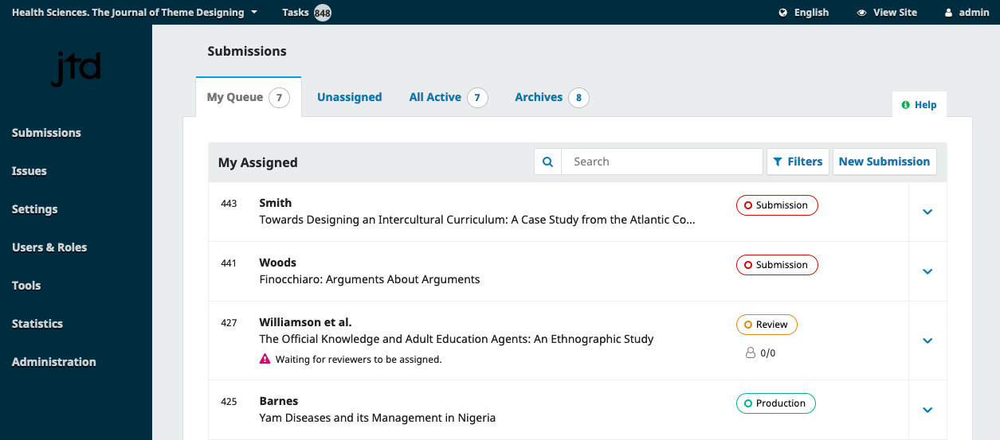

### Mes Soumissions

**Soumissions qui me sont Assigné**: Ce panneau comprend des soumissions ajoutées aux sections où vous êtes un rédacteur de section ou à vos propres soumissions si vous êtes aussi un auteur de cette revue.

L'outil de **Recherche** pour chaque file de Mes Soumissions peut parfois être utile pour traquer les soumissions.

L'outil **Filtrer** vous permet de limiter votre navigation à des status (par exemple, incomplet, en retard, inactif pendant 30 jours) de stades spécifiques (soumission, évaluation, révision, production), ou à des sections (par exemple, articles, évaluations) pour une recherche plus rapide.

Notez que vous pouvez utiliser les flèches bleues à droite de chaque soumission pour révéler plus de détails, y compris le nombre d'évaluations exceptionnelles, les nouvelles discussions, etc. Elles révèlent aussi des boutons vous permettant d'accéder à l'enregistrement de soumission, d'afficher le journal d'activité et les notes, et de supprimer la soumission.

### Non Affectées

Ce panneau comprend les soumissions ajoutées aux sections sans rédacteurs de section.

Dans l'exemple ci-dessus, il n'y a pas de soumissions non affectées, le panneau est donc vide.

### Toutes Actives

Cette section comprend une liste de toutes les soumissions, sans être organisées en files d'attente.

### Archivées

Cette section comprend une liste de toutes les soumissions soit rejetées ou déjà publiées par la revue.

### Soumission de Démonstration

Pour cette démonstration, nous recherchons la soumission de Williamson et Serletis, intitulée *The Official Knowledge and Adult Education Agents* . Elle se trouve en haut de la file d'attente **Soumissions qui me sont Assigné** , ainsi que dans la file **Toutes Actives** .

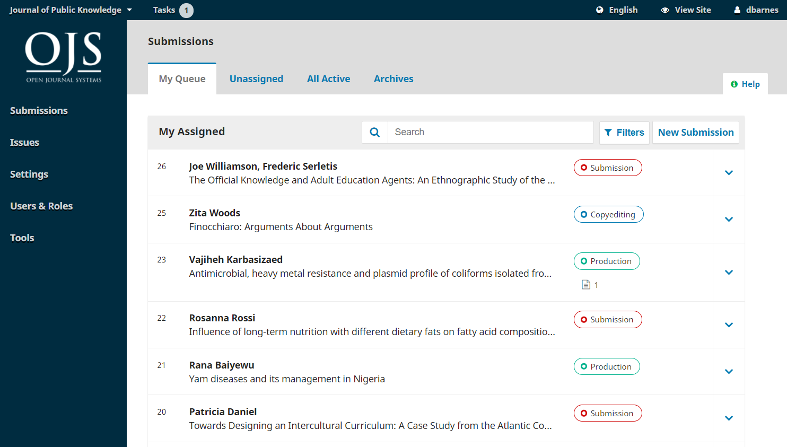

Une fois que vous avez trouvé la soumission, vous pouvez utiliser la flèche bleue pour afficher les options pour voir s'il y a une discussion ouverte (il n'y en a pas), ainsi que pour afficher la soumission, afficher les journaux d'activité et la note, ou pour supprimer la soumission.

**Supprimer** supprimera complètement la soumission et tous les fichiers de soumission de votre revue. Si vous souhaitez garder un enregistrement de la soumission, il est préférable de la **Refuser**, ce qui déplacera la soumission vers l'Archive.

**Journal et Notes d'Activités** afficheront l'historique de la soumission.

### Enregistrement de Soumission

Pour afficher la soumission plus en détail, sélectionnez le bouton **Afficher la Soumission**. Cela vous mènera à l'enregistrement de la soumission.

De là, vous pouvez voir:

**Fichiers de Soumission**: ce panneau liste les fichiers qui ont été soumis. Dans cette vue, il n'y a qu'un seul fichier, mais plusieurs fichiers pourraient avoir été soumis.

**Discussions de Pré-Évaluation** : ce panneau permet au rédacteur/trice de communiquer avec l'auteur, ou avec d'autres membres de l'équipe éditoriale. Par exemple, pour demander à l'auteur des informations supplémentaires, ou pour demander à un-e Rédacteur/trice de section d'assumer la responsabilité de cette soumission.

**Boutons d'Action**: ils incluent Envoyer pour Évaluation, Accepter et Ignorer la l'Évaluation, et Refuser la Soumission.

> Remarque: si vous ne voyez pas ces boutons, vous n'avez probablement pas encore affecté la soumission à un(e) rédacteur/trice.

**État de la Soumission** Une fois qu'un(e) rédacteur/trice a enregistré une décision dans un stade du flux des travaux d'OJS 3.2, la décision enregistrée apparaîtra à la place des boutons de décision. Les rédacteurs auront toujours la possibilité de modifier la décision enregistrée en cliquant sur «Modifier la Décision», cela activera à nouveau les 3 options.

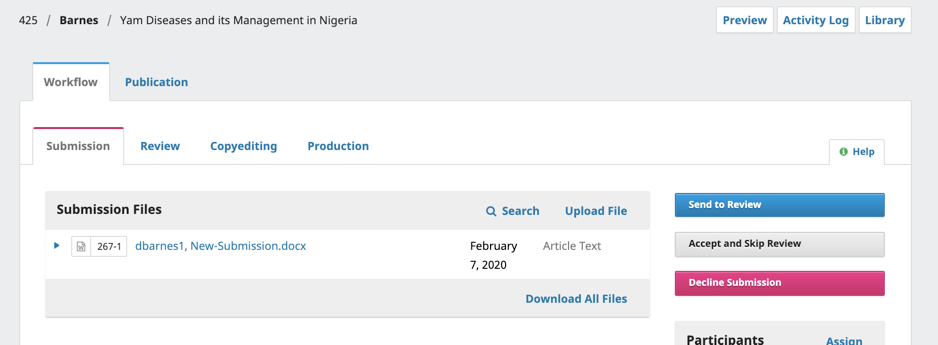 *La capture d'écran ci-dessus montre le bouton de décision pour MS# 425 avant l'enregistrement d'une décision. La capture d'écran ci-dessous montre la notification de la décision enregistrée.*

**Participants** : Ce panneau est l'endroit où vous verrez la liste des participants impliqués dans la soumission, y compris le/la Rédacteur/trice, les rédacteurs de section, et l'auteur. Les autres noms (réviseurs, rédacteurs de mise en page, etc.) apparaîtront ici au fur et à mesure de leur ajout dans les étapes suivantes.

En plus, dans la barre bleue en haut, vous pouvez voir:

**Métadonnées**: où vous pouvez afficher et réviser les métadonnées de soumission. Dans OJS 3.2, les utilisateurs peuvent être autorisés à réviser certaines métadonnées de soumission à n'importe quel stade du flux des travaux.

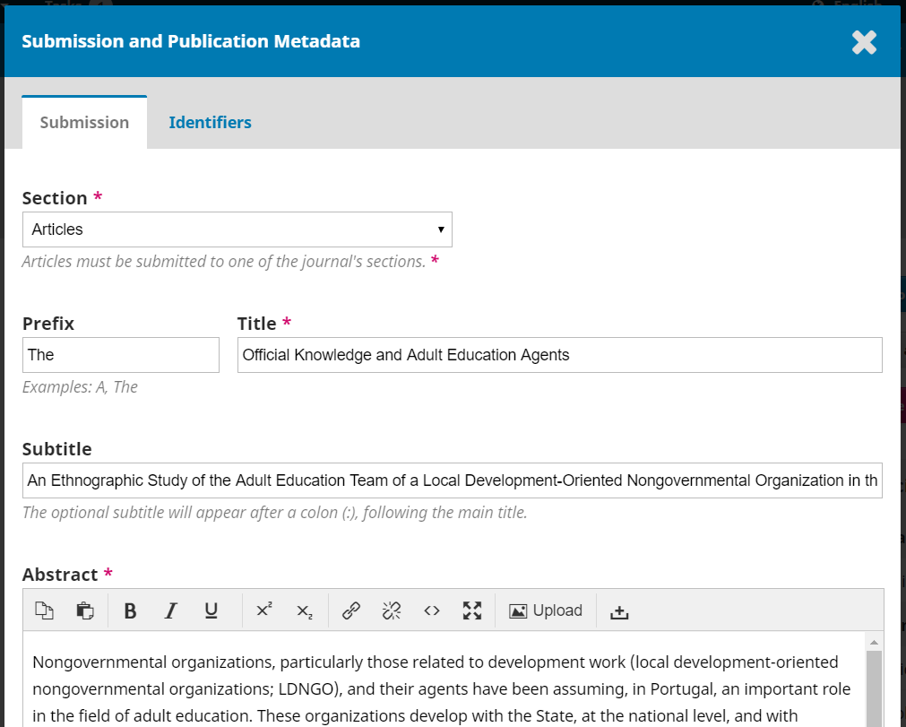

Utilisez l'onglet Identificateurs pour afficher ou ajouter également un identifiant unique.

**Journal d'Activité**: où vous pouvez afficher l'historique et toutes les notes sur la soumission.

Utilisez l'onglet Notes pour afficher ou ajouter des notes éditoriales.

**Bibliothèque de Soumission** : La Bibliothèque de Soumission est une zone de stockage générale pour les documents qui peuvent inclure des formulaires de conflit d'intérêts, des épreuves d'approbation de fichiers, etc. Un-e utilisateur/trice peut télécharger le formulaire rempli pour son manuscrit dans sa Bibliothèque de Soumission. Les formulaires téléchargés seront également disponibles pour les autres participants (à l'exception des Évaluateurs) affectés tout au long du flux des travaux éditoriaux ou de production pour modifier ou télécharger à nouveau de nouvelles versions.

**Bibliothèque de Documents** : les utilisateurs tout au long du flux des travaux éditoriaux pourront accéder à tous les fichiers de la Bibliothèque de le/la Rédacteur/trice (voir le [Chapitre Paramètres du Flux de Travail](./settings-workflow.md) ) mis à disposition par le/la directeur/trice ou le/la Rédacteur/trice de la revue en ouvrant la Bibliothèque de Soumission et en cliquant sur «Afficher la Bibliothèque de Documents».

### Accorder des Autorisations d'Auteur

Dans OJS 3.2, les rédacteurs peuvent accorder l'accès pour permettre aux auteurs d'apporter des modifications aux métadonnées. Il y a deux façons dont les rédacteurs peuvent accorder ce type d'accès.

**Autorisation Globale**- accordera à tous les utilisateurs le rôle «auteur» ce qui est une autorisation de modifier les métadonnées.

Pour activer cela, allez à Utilisateurs et Rôles > Rôles. Cliquez sur la flèche bleue à côté de «Auteur», puis sur modifier.

Sous Options de Rôle, activez "Autoriser la modification des métadonnées de soumission." puis cliquez sur OK.

**Autorisation Limitée**- accordera aux auteurs enregistrés (généralement un seul auteur) la permission d'apporter des modifications seulement à certains stades du flux des travaux éditoriaux.

Pour permettre à un auteur de modifier les métadonnées à un stade spécific du flux des travaux, cliquez sur le stade du flux des travaux (c'est-à-dire, Soumission, Évaluation, Révision, ou Production).

Sous la liste des participants, cliquez sur la flèche à côté du nom de l'auteur, puis sur Modifier.

Sous Autorisations, activez "Autoriser cette personne à modifier les détails de la publication." puis cliquez sur OK.

Une fois que l'auteur a obtenu l'accès d'apporter des modifications, ils pourront apporter des modifications aux sections suivantes de l'onglet Publication: Titre et Abstract, Contributeurs, et Métadonnées.

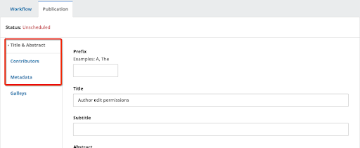

### Affecter la Soumission

Selon la façon dont vous avez configuré vos sections, quelques nouvelles soumissions peuvent être non affectées. Si tel est le cas, la prochaine étape consiste à affecter un(e) rédacteur/trice ou un(e) rédacteur/trice de section. Pour ce faire, sélectionnez le lien *Affecter* dans le panneau **Participants** .

Vous aurez la possibilité de localiser un(e) utilisateur/trice par rôle, de choisir une personne, et de lui envoyer un message demandant son assistance.

> Remarque: Si vous n'êtes pas sûr des noms des rédacteurs de section, choisissez simplement ce rôle dans le menu déroulant, puis cliquez sur le bouton Rechercher. Tous les rédacteurs de section seront affichés et disponibles pour la sélection.

Cliquez sur le bouton **OK** pour compléter l'affectation et envoyer le message.

> Notez la nouvelle discussion de Pré-Évaluation qui a été automatiquement créée dans le cadre de l'affectation.

Vous pouvez maintenant voir que le/la Rédacteur/trice de section est listé sous Participants et que les boutons Action sont disponibles:

**Envoyer pour Évaluation**: fait passer la soumission au stade suivant.

**Accepter et Ignorer l'Évaluation**: ignore le stade d'Évaluation et déplace la soumission directement au stade de Révision.

**Refuser la Soumission**: rejette la soumission avant de passer par le processus d'Évaluation. La soumission serait alors archivée.

Malgré que dans cet exemple, le/la Rédacteur/trice ait affecté un(e) Rédacteur/trice de section, il serait également possible pour le/la Rédacteur/trice de s'affecté eux-mêmes à la soumission.

Une fois que le/la Rédacteur/trice a sélectionné une action, le statut de soumission changera et les boutons d'action seront désactivés.

### Rédacteur/trice de Section

Maintenant que le/la Rédacteur/trice de Section a été affecté, ils peuvent se connecter et afficher leur tableau de bord. La soumission se trouve en haut de la file d'attente Soumissions qui me sont Assigné.

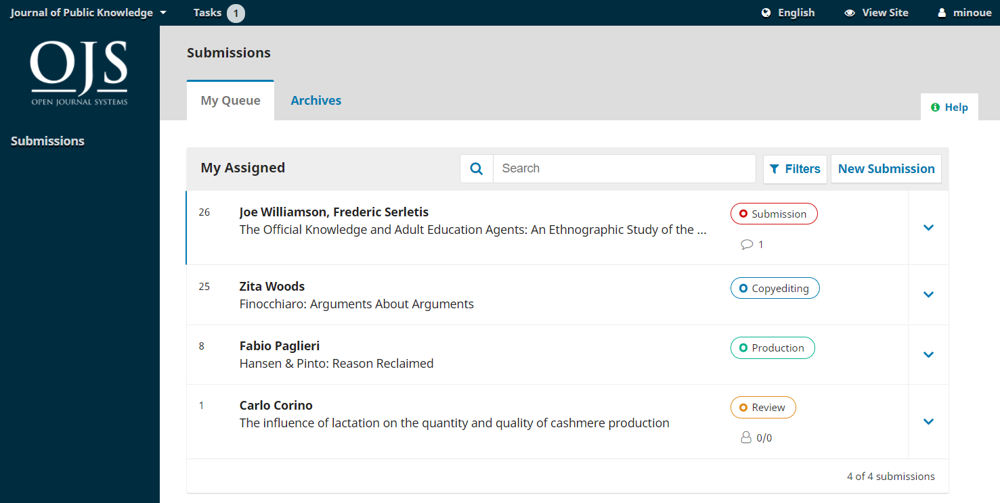

Cliquez sur le titre de l'article pour ouvrir le dossier de soumission complet.

#### Accepter l'Affectation

Ceci n'est pas nécessaire, mais le/la Rédacteur/trice de section peut répondre à la Discussion de Pré-Évaluation pour informer le/la Rédacteur/trice qu'il va travailler sur l'affectation.

#### Communiquer avec l'Auteur

Si le/la Rédacteur/trice de Section a des questions pour l'auteur, il peut utiliser les Discussions de Pré-Évaluation.

#### Envoi pour Évaluation

Une fois que le/la Rédacteur/trice de Section est satisfait(e) et convaincu(e) que la soumission est appropriée pour la revue, il/elle peut sélectionner le bouton **Envoyer pour Évaluation** pour faire passer la soumission au stade suivant.

Gardez les fichiers à évaluer cochés.

## Évaluation

Lorsque la soumission passe au Stade d'Évaluation, une notification indique que des Évaluateurs doivent être affectés.

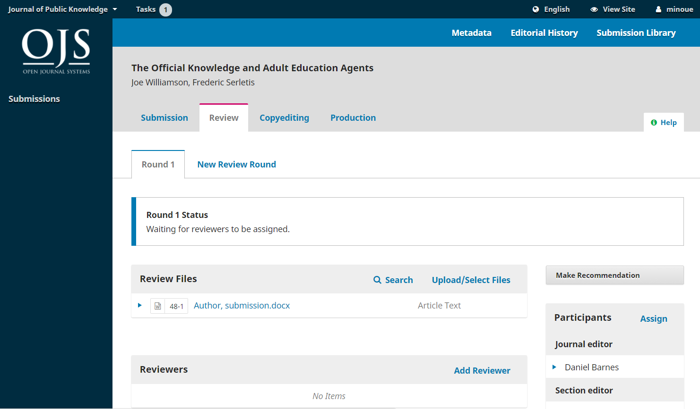

> Remarque: dans la capture d'écran ci-dessus, nous voyons la vue de le/la Rédacteur/trice de Section. Notez les boutons d'action limités (seul l'option Faire une Recommandation est disponible). Si nous étions connectés en tant que rédacteur/trice, nous verrions plus de boutons d'action (Demander la Révision, Accepter la Soumission, Refuser la Soumission).

Dans le panneau Évaluateurs, vous pouvez sélectionner Ajouter un-e Évaluateur/trice pour affecter un-e nouveau/velle Évaluateur/trice.

Cela ouvre une nouvelle fenêtre, où les Évaluateurs sont listés et peuvent être sélectionnés un par un.

En cliquant sur la flèche bleue, vous obtiendrez plus d'informations sur l'historique de leurs Évaluations, y compris le nombre d'Évaluations actives qui leur sont actuellement affectées, le nombre d'Évaluations qu'ils ont terminées ou refusées, etc. Si l'utilisateur/trice a ajouté une biographie ou des centres d'intérêt d'Évaluation, ces informations seront affichées ici.

De plus, le/la Rédacteur/trice de la Revue peut ajouter une Note Éditoriale à propos de l'Évaluateur/trice dans son profil sous Utilisateurs et Rôles > Utilisateurs. Cette note apparaîtra dans les détails de l'Évaluateur/trice sur l'écran Ajouter un-e Évaluateur/trice, mais ne sera pas visible par l'Évaluateur/trice ni par le public.

Dans les versions OJS 3.0 à 3.1.0, vous ne pouvez pas affecter un-e utilisateur/trice pour évaluer une soumission s'ils sont également un-e rédacteur/trice de la soumission. Si vous le faites, le/la Rédacteur/trice ne pourra plus accéder la soumission après avoir soumis son évaluation, afin de maintenir les principes de l'évaluation à l'aveugle par les pairs. Cependant, à partir de OJS 3.1.1, vous pouvez affecter un-e utilisateur/trice pour réviser une soumission s'il/elle est également un-e rédacteur/trice de la soumission.

Au bas de ce formulaire, vous verrez des options pour:

**Sélectionner un-e Évaluateur/trice**: utilisez cette option pour confirmer votre sélection une fois que vous avez choisi un-e Évaluateur/trice de la liste.

**Créer un-e Nouveau/velle Évaluateur/trice**: si aucun des Évaluateurs ne vous convient, vous pouvez utiliser ce bouton pour créer un-e nouveau/velle Évaluateur/trice. Ceci crée un nouveau compte dans le système.

**Inscrire un(e) Utilisateur/trice Existant(e)**: si aucun des Évaluateurs ne vous convient, vous pouvez inscrire un-e utilisateur/trice existant-e en tant qu'Évaluateur/trice.

Pour cette démonstration, nous choisirons Adela comme notre Évaluatrice et cliquerons sur le bouton **Sélectionner un-e Évaluateur/trice** .

Cela ouvre une nouvelle fenêtre avec un message pour la Évaluatrice.

Vous pouvez réviser n'importe quel texte préparé.

Si vous utilisez une méthode d'Évaluation à l'Aveugle, assurez-vous que les fichiers que vous envoyez à l'Évaluateur/trice sont démunis de toute information qui peut identifier l'auteur. Des instructions supplémentaires à ce sujet sont fournies dans les sections [Comprendre l'Évaluation à l'aveugle](#understanding-blind-review) et [Enlever les Informations d'Identification](#removing-identifying-information) .

Plus bas dans le formulaire, vous verrez les détails supplémentaires qui sont envoyés à l'Évaluateur/trice, y compris le titre, le résumé, les dates importantes, et un lien vers les fichiers à évaluer.

Par défaut, les Évaluateur seront fournis d'une large zone de texte pour écrire leur commentaires. Néanmoins, le/la Directeur/trice de la Revue peut créer des Formulaires de Révision sous [**Paramètres de Flux des Travaux > Évaluation**](https://docs.pkp.sfu.ca/learning-ojs/en/journal-setup#workflow-settings) pour demander des questions plus spécifiques. Si vous voulez que l'Évaluateur/trice remplisse un formulaire de Évaluation, sélectionnez cela sous **Formulaire d'Évaluation**.

Cliquez sur le bouton **Ajouter un-e Évaluateur/trice** pour envoyer le message et affecter l'Évaluateur/trice.

De retour au stade d'Évaluation, nous pouvons voir que l'Évaluateur/trice est maintenant listé-e.

Vous pouvez apporter des modifications supplémentaires à l'aide de la flèche bleue à côté du nom de l'Évaluateur/trice.

**Détails d'Évaluation**: fournit des détails sur l'évaluation.

**Envoyer un Email à l'Évaluateur/trice**: vous permet d'envoyer un message à l'Évaluateur/trice.

**Modifier l'Évaluation**: vous permet de modifier les dates et les fichiers de l'Évaluation.

**Annuler l'Affectation de l'Évaluateur/trice**: vous permet de supprimer l'affectation de l'Évaluateur/trice.

**Annuler la Demande d'Évaluation** : à partir de OJS 3.2, vous pouvez annuler une demande d'évaluation. Cela peut être nécessaire lorsqu'un évaluateur n'a pas répondu à une demande de révision ou a accepté de faire une évaluation mais n'a jamais présenté de résultats. 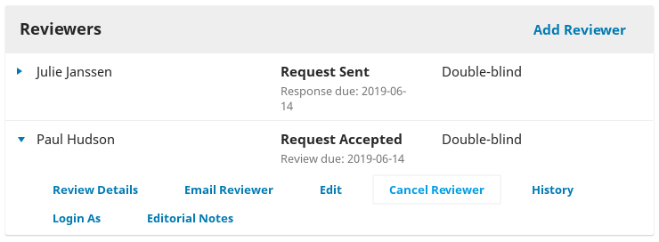

L'annulation d'une demande d'évaluation vous permettra d'envoyer un modèle d'email à l'Évaluateur/trice. La demande apparaîtra alors dans la liste des Évaluateurs du rédacteur/trice comme "annulée". 

L'évaluation annulée sera enregistrée dans les statistiques de l'Évaluateur/trice que vous pouvez voir lors de la sélection d'un-e Évaluateur/trice. 

**Discussion d'Évaluation**: La discussion d'Évaluation est un autre moyen pour vous de contacter un-e Évaluateur/trice. Dans une discussion d'évaluation, vous avez la possibilité de joindre des fichiers.

Pour commencer une discussion, cliquez sur "Ajouter une Discussion". 

Vous sélectionnerez ensuite les Évaluateurs avec lesquels vous souhaitez commencer une discussion.

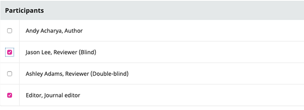

**Historique** : fournit un bref historique d'évaluation.

À ce point, nous pourrions ajouter des Évaluateurs supplémentaires, puis attendre que leurs recommandations arrivent.

### Comprendre l'Évaluation à l'Aveugle

OJS est conçu pour accueillir différents types d'évaluations et comporte des étapes intégrées pour garantir l'anonymat.

Toutes les informations seront visibles pour les directeurs et rédacteurs de la revue quel que soit le type d'évaluation sélectionné. Le type d'évaluation sera automatiquement sélectionné en fonction de ce qui a été configuré sous *Paramètres* > *Flux des Travaux* > *Évaluation*. Les rédacteurs peuvent modifier le type d'évaluation lors de l'envoi de la demande d'évaluation. Les rédacteurs/rédacteurs de section doivent sélectionner le type d'évaluation lors de l'envoi de la demande d'évaluation parmis les options suivantes:

- Double-Aveugle
- Aveugle
- Ouvert

**Évaluation en Double-Aveugle**: l'identité de l'auteur et de l'évaluateur/trice sont gardées cachées.

L'auteur ou le/la rédacteur/trice doit s'assurer que les métadonnées du fichier manuscrit sont supprimées lors d'une évaluation en Double-Aveugle. Voir [Supprimer les informations d'identification](#removing-identifying-information) pour plus d'informations.

*Évaluateur!trice:* L'Évaluateur/trice ne sera pas en mesure de voir le(s) auteur(s) dans la file d' attente de l'évaluateur/trice si le/la rédacteur/trice a sélectionné une évaluation en double-aveugle. Toutes les informations d'identification dans les métadonnées des détails de soumission sont automatiquement supprimées par le système.

À la fin d'une évaluation, si un-e évaluateur/trice choisit de télécharger un fichier d'évaluation, toutes les informations d'identification doivent être supprimées avant de le télécharger dans le système. Voir [Supprimer les Informations d'Identification](#removing-identifying-information) pour plus d'informations.

*Auteur*: Aucune information d'identification concernant l'évaluateur/trice ne sera visible par l'auteur dans la vue de son manuscrit.

*Décision des Rédacteurs*: L'email de décision envoyé aux auteurs à la fin d'une évaluation aura les titres génériques des Évaluateurs.

**Évaluation à l'Aveugle**: l'identité de l'Évaluateur/trice est gardée anonyme par rapport aux auteurs. Les Évaluateurs peuvent voir les détails de l'auteur.

*Évaluateur/trice*: L'Évaluateur/trice sera capable de voir les métadonnées complètes fournies pas l'auteur en cliquant sur *Afficher Tous les Détails de la Soumission* dans l'onglet de demande du manuscrit. Le nom de l'auteur sera aussi affiché dans la file d'attente de l'Évaluateur/trice.

*Auteur*: Aucune information d'identification concernant l'Évaluateur/trice ne sera disponible dans la vue de son manuscrit.

*Décision des Rédacteurs*: L'email de décision envoyé aux auteurs à la fin d'une évaluation aura les titres génériques des évaluateurs.

### Supprimer les Informations d'Identification

Même si OJS dispose d'un certain nombre de fonctions intégrées pour les évaluations à l'aveugle, des étapes supplémentaires peuvent être nécessaires en dehors de la plate-forme pour garantir une évaluation en double-aveugle. Un fichier de soumission peut contenir des informations permettant d'identifier l'identité des auteurs dans les propriétés du document.

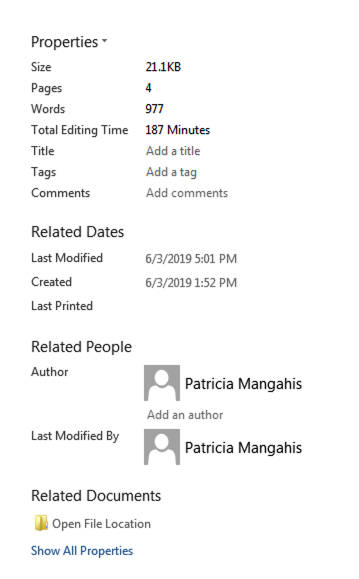

Les auteurs peuvent aussi inclure leur nom dans l'article, les notes de bas de page, ou les références, auquel cas le/la rédacteur/trice devra supprimer cela avant d'envoyer la soumission pour évaluation. Comme alternatif, les auteurs peuvent être invités à remplacer leurs noms dans le fichier de soumission avec «Auteur», et remplacer l'année utilisée dans les références et les notes de bas de page au lieu du nom des auteurs, du titre de l'article, etc., avant la soumission.

#### Microsoft Word pour Windows

1. Allez à *Fichier*
2. Sélectionnez *Info*
3. Cliquez sur *Vérifier les Problèmes*
4. Cliquez sur *Inspecter le Document*
5. Dans la boîte de dialogue *Inspecteur de Document* , cochez les cases pour choisir les types de contenu masqué que vous souhaitez inspecter
6. Cliquez sur *Supprimer Tout*
7. Cliquez sur *Fermer*
8. Sauvegarder le document

#### Microsoft Word pour MacOS

1. Aller à *outils*
2. Cliquez sur *Protéger le Document*
3. Sélectionnez *Supprimer les Informations Personnelles de ce Fichier lors de l'Enregistrement*
4. Cliquez sur *OK* et enregistrez le fichier

### Retélécharger le Document

Les directeurs et rédacteurs de revue peuvent retélécharger le document anonyme dans les fichiers d'Évaluation en cliquant sur **Télécharger / Sélectionner Fichiers** dans la zone d'*Évaluation des Fichiers* .

Cliquez sur **Télécharger le Fichier d'Évaluation** .

Identifiez le composant de l'article et téléchargez le fichier.

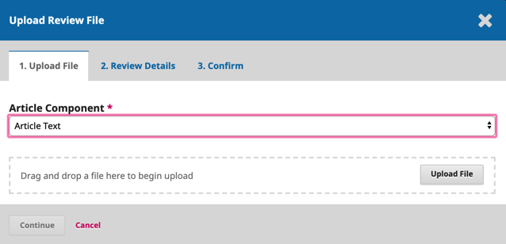

Détails d'Évaluation. Il peut être utile de renommer le fichier au moment de  retéléchargement. Le fichier peut également être renommé en cliquant sur la flèche à gauche du nom du fichier.

Cliquez sur Terminer et sélectionnez le fichier que vous souhaitez utiliser pour l'Évaluation.

Les fichiers apparaîtront sous le téléchargement initial. Lors de l'envoi de la demande d'Évaluation, assurez-vous que le manuscrit original n'est pas sélectionné dans les «Fichiers à Évaluer».

Sélectionnez les Fichiers d'Évaluation et cliquez sur **OK** .

### Répondre aux Évaluations

Une fois que les Évaluateurs ont terminé leur travail, le/la rédacteur/trice de section peut voir les résultats dans leur tableau de bord. Ici, ils verront les notifications indiquant que de nouvelles Évaluations ont été soumises et si toutes les Évaluations ont été soumises.

Utilisez le lien *Lire l'Évaluation* dans le panneau Évaluateurs pour lire les commentaires des Évaluateurs, y compris ceux de l'auteur et de le/la rédacteur/trice ainsi que de le/la rédacteur/trice uniquement.

Sélectionnez le lien *Confirmer* au bas de l'écran.

Dans le panneau des Évaluateurs, vous pouvez maintenant voir un lien de *Remercier Évaluateur/trice*. Choisissez cela pour remercier l'Évaluateur/trice.

Appuyez sur le bouton **Remercier Évaluateur/trice** pour envoyer le message.

### Prendre une Décision

Basé sur les recommandations de l'Évaluateur/trice, vous pouvez utiliser les boutons d'action pour prendre une décision.

Les options comprennent:

**Demander des Révisions**: Cela nécessitera que l'Auteur apporte des modifications mineures, le/la rédacteur/trice a la possibilité de choisir si un autre cycle d'évaluation sera nécessaire.

**Accepter la Soumission**: cela signifie que la soumission est acceptée sans révisions et peut passer à l'étape de Révision.

**Refuser la Soumission**: Cela signifie que la soumission n'a pas été soumise à une évaluation par les pairs et qu'elle ne convient pas pour une évaluation plus approfondie. La soumission serait ensuite transférée aux archives.

### Demande d'Évaluations

Dans cette démonstration, nous allons demander à l'auteur de faire quelques révisions mineures avant l'acceptation.

Pour ce faire, sélectionnez le bouton **Demande d'Évaluations**. Cela entraîne une nouvelle fenêtre de message.

Vous pouvez modifier n'importe quel texte avant d'envoyer le message.

Utilisez le bouton **Ajouter des Évaluations** pour importer les commentaires de l'Évaluateur/trice à partir du champ Rédacteur/trice et Auteur. Les commentaires du champ Rédacteur/trice uniquement ne seront pas affichés.

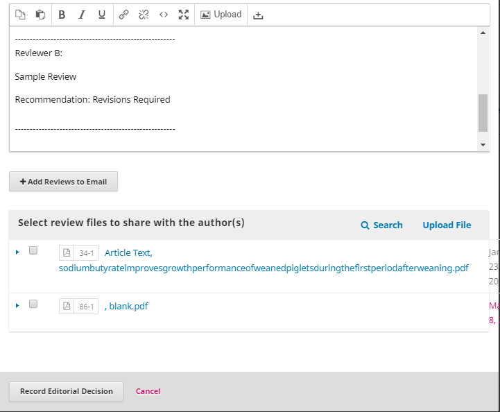

S'il y a des pièces jointes, comme un fichier balisé créé par un-e Évaluateur/trice, vous pouvez le joindre ici (tant qu'il a été anonymisé). Dans OJS 3.1.2 et versions ultérieures, vous pouvez également télécharger un nouveau fichier et l'ajouter en tant que pièce jointe.

Appuyez sur le bouton **Enregistrer la Décision Éditoriale** pour envoyer le message.

Vous devez maintenant attendre que l'auteur réponde avec ses révisions.

### L'Auteur Répond

Une fois que l'auteur a effectué les révisions, vous devriez recevoir un message (par email et via le panneau des Discussions d'Évaluation).

Vous verrez également le fichier révisé dans le panneau Révisions.

À ce point, vous pouvez télécharger le fichier révisé, vérifier qu'il est prêt et communiquer avec l'Auteur à l'aide du panneau Discussions d'Évaluation.

Dans ce cas, nous allons informer l'auteur que nous acceptons les révisions. Pour ce faire, cliquez sur le titre lié de la discussion. Cela ouvrira la boîte de discussion.

Utilisez le bouton **Ajouter un Message** pour répondre.

Une autre option serait de demander des révisions supplémentaires, mais à ce stade, nous sommes prêts à passer à autre chose.

### Cycle d'Évaluation Supplémentaire

Si vous souhaitez soumettre l'article évalué à un autre cycle d'évaluation, vous pouvez commencer un deuxième cycle d'évaluation (ou troisième ou suivant) une fois que les évaluations de l'auteur ont été reçues.

It is best to start a new round of review **after** an author uploads revised files on the previous round. Creating a New Round of review before the author has uploaded their files could create some confusion as their dashboard (and yours) will default to the new round. The author will, however, be able to switch back to Round 1 to upload their files.

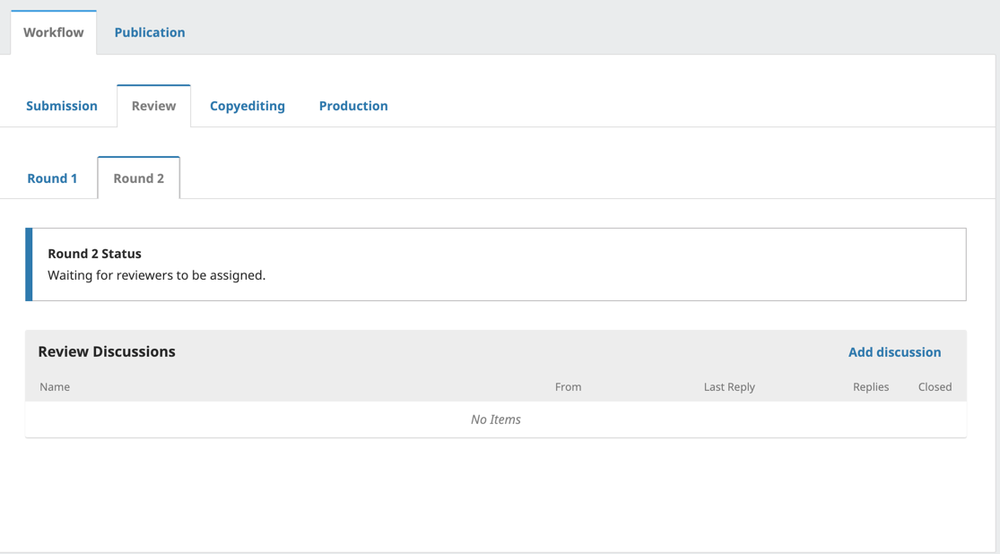

Cela vous obligera également à télécharger le fichier téléchargé à partir du premier cycle et à le télécharger dans le deuxième cycle si vous choisissez de suivre cette voie.

Un nouveau cycle **ne doit pas** être commencé si vous avez des problèmes avec le cycle actuel (par example, vous êtes incapable d'enregistrer la décision, vous avez reinviter un-e Évaluateur/trice refusé-e ou supprimé-e).

Pour commencer un cycle d'évaluation supplémentaire une fois que les fichiers évalués ont été reçus, cliquez sur l'onglet **Nouveau Cycle d'Évaluation** dans l'onglet d'évaluation du manuscrit.

Cela ouvrira un autre menu pour vous permettre de sélectionner les fichiers (fournis par l'auteur) à inclure pour le nouveau cycle d'évaluation.

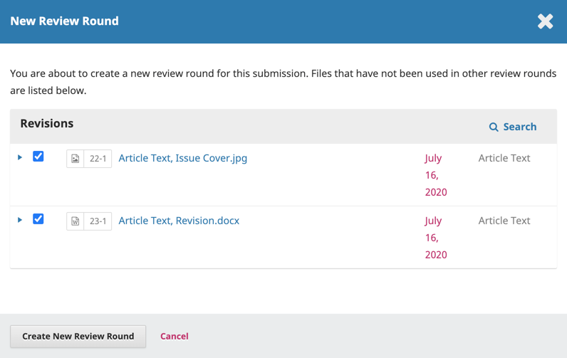

If there are any additional files you want to make available again from the previous round, this can be done by clicking **Upload/Select Files**. Click **Show files from all accessible workflow stages**.

Les fichiers disponibles lors du premier cycle doivent apparaître sous Soumission. Les fichiers qui apparaissent sous Évaluation afficheront uniquement les fichiers téléchargés par l'auteur du cycle précédent (c'est-à-dire les fichiers révisés du premier cycle). Si vous êtes au troisième cycle (et au-delà) et que vous avez besoin de fichiers du premier ou deuxième cycle, vous devrez les télécharger sur votre bureau local et les re-télécharger en utilisant **Télécharger/Sélectionner des Fichiers** .

Similarly, if there are any additional files authors provide after they upload the resubmission, you can upload them using **Upload/Select Files**.

Une fois que vous êtes prêt à commencer le nouveau cycle d'évaluation, attribuez des Évaluateurs comme vous l'avez fait lors du cycle précédent. Vous pouvez affecter les mêmes Évaluateurs ou différents Évaluateurs.

Les Évaluateurs des cycles précédents n'auront pas accès aux commentaires qu'ils ont partagés lors d'un cycle précédent. Si un-e Évaluateur/trice a demandé ses commentaires d'un cycle précédent, le/la rédacteur/trice peut copier ceci du premier cycle - Détails d'Évaluation et démarrer une discussion dans le deuxième cycle. Sinon, le journal peut choisir d'encourager la soumission de la Réponse à l'Évaluateur/trice dans le cadre de la nouvelle soumission .

Ces étapes peuvent être répétées jusqu'à ce qu'une décision finale d'accepter ou de refuser le manuscrit ait été prise.

### Passer à la Révision

La soumission est maintenant prête à être déplacée vers la Révision. Pour ce faire, utilisez le bouton bleu **Accepter la Soumission** .

Cela ouvrira une nouvelle fenêtre.

Appuyez sur le bouton **Enregistrer la Décision Éditoriale** en bas de la fenêtre.

La soumission est automatiquement déplacée vers l'étape de Révision.

De retour sur l'onglet d'évaluation, vous remarquerez que le statut indique maintenant que la soumission a été acceptée.

## Révision

Lorsqu'une soumission est acceptée à l'Étape d'Évaluation, elle passe automatiquement à l'étape de Révision.

### Ajout d'un-e Réviseur/euse

Lorsque la soumission entre dans la phase de Révision, une notification indique qu'un-e Réviseur/euse doit être affecté. Les Réviseurs peuvent être attribués à l'aide du lien *Ajouter* sur le panneau Participants.

Cela ouvrira une nouvelle fenêtre.

Vous pouvez utiliser la liste déroulante des rôles pour choisir un-e Réviseur/euse et cliquer sur le bouton **Rechercher**. Cela fera apparaître tous les Réviseurs.

Sélectionnez l'un des Réviseurs pour cette soumission.

Choisissez un message préparé.

Apportez les modifications nécessaires au message.

Appuyez sur **Envoyer** .

Vous pouvez maintenant voir la nouvelle notification indiquant que la soumission est en attente de révisions, le/la réviseur/euse est maintenant inclus dans la liste des Participants et la demande est visible dans les Discussions de Révision.

Vous pouvez maintenant attendre que le/la réviseur/euse fasse son travail.

### Réviseur/euse

The Copyeditor will receive an email message from the Section Editor requesting them to take on the submission.

Pour commencer, ils doivent se connecter et trouver la soumission à partir de leur tableau de bord.

Ensuite, ils peuvent cliquer sur le lien Révision à côté du nom de la soumission. Cela les mènera directement à l'étape de Révision pour cette soumission.

De là, ils peuvent voir les Fichiers Brouillons. Ce sont les fichiers qui nécessitent une révision. Cliquez sur le titre lié pour télécharger le fichier sur leur bureau.

En dehors d'OJS, ils effectueront le travail de révision.

Pour vérifier les métadonnées de soumission, utilisez le lien Métadonnées dans la barre bleue en haut.

Cela inclurait la vérification du titre de l'article, du résumé, des noms des auteurs, des mots clés, etc.

Si des modifications sont apportées, cliquez sur le bouton **Enregistrer** avant de quitter cette fenêtre.

#### Consulter avec l'Auteur

Une fois la révision terminée, ils exécuteront les modifications au-delà de l'auteur en ajoutant une nouvelle discussion, en utilisant le lien *Ajouter une discussion* du panneau de Discussions de Révision.

Dans la fenêtre Ajouter une discussion, ils doivent choisir l'auteur et ajouter une ligne de sujet et un message.

Further down that same window, they must upload a copy of the copyedited file.

To do so, use the *Upload File* link. This will open a new window where you must choose the *Article Component* (e.g., article text) and upload the file.

Appuyez sur **Continuer** pour continuer.

Cela ouvrira l'étape suivante, où vous pourrez modifier le nom de fichier si nécessaire.

Ensuite, vous pouvez télécharger plus de fichiers si nécessaire, ou appuyez sur **Terminé** .

De retour dans la fenêtre Ajouter, vous pouvez maintenant voir le fichier joint.

Appuyez sur **OK** pour envoyer le message à l'auteur.

Le message est maintenant visible dans les Discussions de Révision.

Vous pouvez maintenant attendre la réponse de l'auteur.

### L'Auteur Répond

Une fois que vous avez reçu une réponse de l'auteur, vous pouvez consulter ses commentaires en vérifiant la réponse à la discussion.

De là, vous pouvez voir qu'aucune autre modification n'est requise.

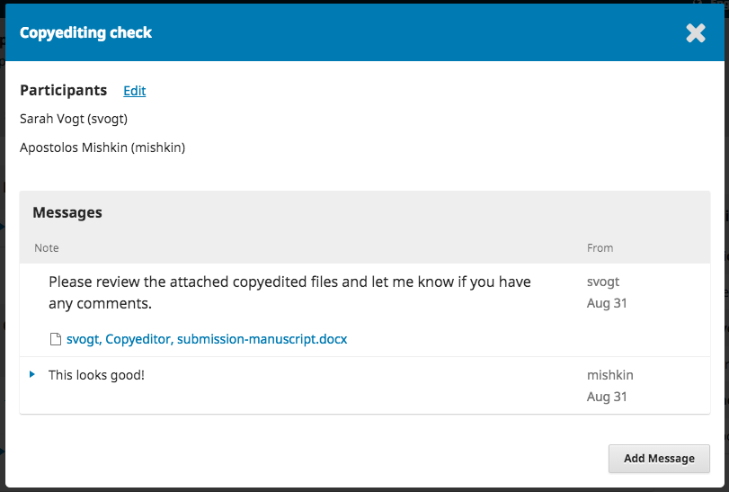

### Le Fichier Révisé Final

Vous pouvez maintenant télécharger la version révisée finale dans le panneau Révisé, près du bas de l'écran.

Utilisez le lien Télécharger/Sélectionner des fichiers pour télécharger la version révisée finale.

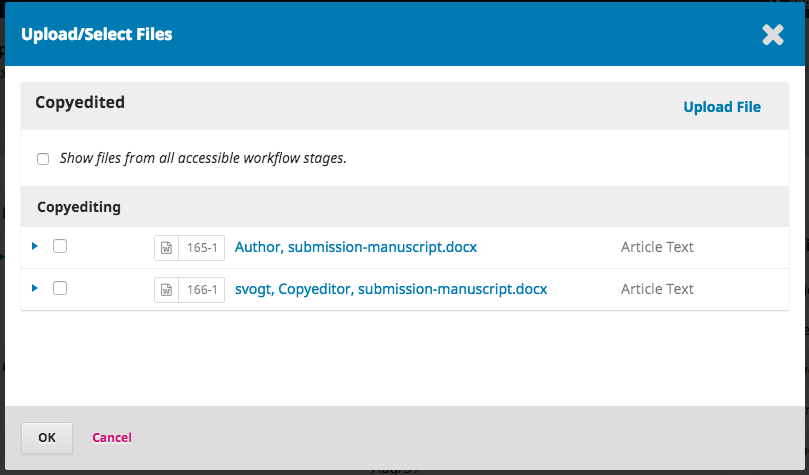

Il est important de noter ici que vous avez quelques choix.

1. Vous pouvez utiliser le lien Télécharger un Fichier pour télécharger un nouveau fichier (par exemple, un fichier avec quelques modifications récentes depuis que vous l'avez montré à l'auteur).
2. Vous pouvez sélectionner la version originale de l'auteur (peu probable).
3. Vous pouvez sélectionner la version du/de la Réviseur/euse, qui est la version que vous avez envoyée à l'auteur (si vous n'avez apporté aucune autre modification, choisissez celle-ci).

Pour cette démonstration, nous sélectionnerons la version du/de la Réviseur/euse **en cochant la case** à gauche de ce fichier.

Appuyez sur **OK** .

Le fichier est maintenant visible dans le panneau *Révisé* (près du bas de l'écran), indiquant au rédacteur/trice qu'il s'agit de la version finale, qui est prête pour l'étape de Production.

### Inform the Section Editor

The final step is for you to inform the Section Editor that the copyediting is complete.

Pour ce faire, démarrez une nouvelle Discussion de Révision en utilisant le lien *Ajouter une Discussion* .

In the discussion window, add the Section Editor, a subject line, and a message.

Appuyez sur **OK** pour envoyer le message.

Retournant vers l'étape de Révision, vous pouvez voir que le message est publié.

Votre travail en tant que réviseur/euse est maintenant terminé!

### Passer à la Production

The Section Editor will receive an email that the copyediting is complete, and see a notification in the discussions.

Vous pouvez télécharger et consulter la version révisée finale à partir du panneau Révisé.

À ce stade, vous pouvez communiquer davantage avec le/la Réviseur/euse ou, si vous êtes satisfait, déplacer la soumission vers l'étape de Production.

Pour ce faire, sélectionnez le bouton bleu **Envoyer en Production** .

Cela va générer un préavis officiel aux Auteurs indiquant que la soumission passe à l'étape suivante.

Notez que le fichier approprié, du panneau Révisé, est inclus et sera automatiquement transféré vers la Production.

Cliquez sur **Enregistrer la Décision Éditoriale** pour continuer.

L'étape de Révision est maintenant terminée et l'état de la soumission sera mis à jour. Le chapitre suivant couvre la phase de Production et de Publication.

