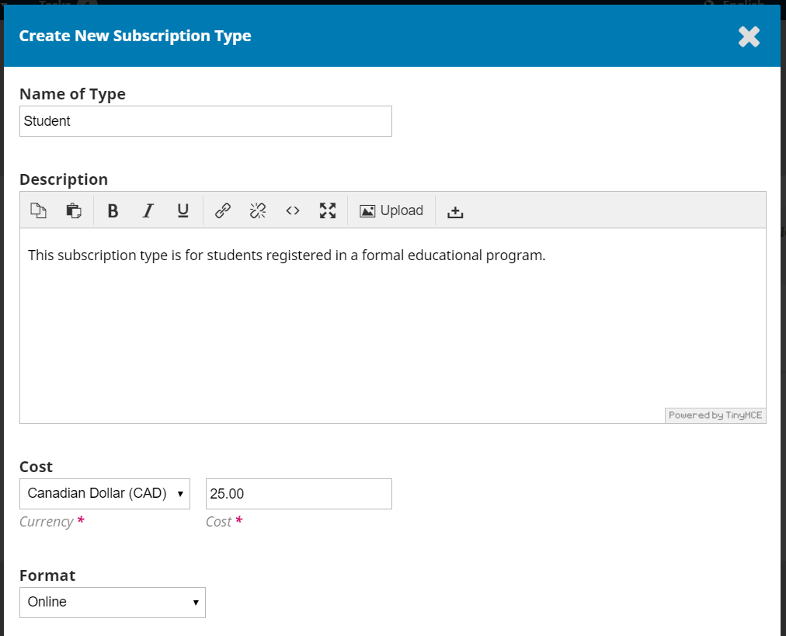
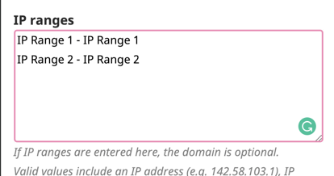

# Abonnements

OJS vous permet de restreindre l'accés à tout ou juste une partie de votre contenu aux abonnés. Pour activer les Abonnements, accédez d'abord à [Paramètres > Distribution > Accès](./settings-distribution.md) .

## Politiques d'abonnement

Remplissez les détails de vos politiques d'abonnement sur cette page.

- **Responsable des Abonnements**: ajoutez les détails personnels de la personne responsable.
- **Renseignement sur l' Abonnement**: ajoutez des détails des règles à afficher sur le site Web de la revue.
- **Échéance de l'Abonnement**: déterminez si les anciens abonnés doivent continuer à avoir accès au contenu plus ancien.
- **Rappel de l'échéance de l''Abonnement**: configurez des rappels de renouvellement automatisés.
- **Avis de Paiement en Ligne**: tenez le/la Directeur/trice d'Abonnement informé-e des activités de paiement.
- **Options pour le libre accès pour les revues sous abonnement**: Sélectionnez le nombre de mois actuels pour lesquels vous souhaitez restreindre l'accès. Le contenu plus ancien sera automatiquement ouvert.

## Types d'Abonnement

La prochaine étape de la configuration de la gestion des abonnements consiste à désigner les types d'abonnements proposés par la revue.

Les revues proposent généralement les prix pour des abonnements individuels et des abonnements institutionnels. Certaines revues peuvent proposer des offres spéciales aux membres d'une organisation ou aux étudiants. OJS soutiendra la gestion des abonnements imprimés et/ou en ligne. Plus d'un type d'abonnement peut être créé pour couvrir des périodes plus longues (12 mois, 36 mois).

Sélectionnez **Créer un Nouveau Type d'Abonnement** pour en ajouter un nouveau.

- **Nom du Type**: donnez à ce nouveau type d'abonnement un nom unique (par exemple, étudiant).
- **Description**: Fournissez une brève description qui apparaîtra sur le site Web.
- **Coût**: sélectionnez le type de devise et le montant.
- **Format** : choisissez le format approprié (par exemple, en ligne).
- **Durée**: entrez le nombre de mois que ce type d'abonnement couvrira (par exemple, 12).
- **Abonnements**: indiquez si ce type couvre les individus ou les institutions.
- **Options** : sélectionnez les options appropriées (si il y en a).

## Types de Paiement

Si vous ne l'avez pas déjà fait, allez dans [Paramètres > Distribution > Paiements](./settings-distribution.md) et définissez la devise et le mode de paiement appropriés (par exemple, PayPal).

Utilisez cette page pour définir les montants facturés pour différents types de frais.

### Frais de publication pour un article

Si vous souhaitez facturer des frais de traitement d'article (Article Processing Charge -- APC) aux auteurs, saisissez le montant ici. Activer les frais d'auteur vous permettra de demander des frais de traitement d'article une fois le processus d'évaluation terminé. Lorsque l'article est accepté par l'éditeur/trice, l'éditeur/trice aura la possibilité d'exiger un paiement. Cela entraînera la réception d'une notification par l'auteur dans OJS et d'un email, qui le dirigera tout au long du processus de paiement.

Note that the option to notify authors about the Author Fee will appear only when the payment details (PayPal account details or manual PayPal instructions) have been completed in [Settings > Distribution > Payments](./settings-distribution#payments).

Vous pouvez appliquer les frais aux fichiers PDF uniquement en cochant " Limiter l'accès uniquement aux articles et numéros en format PDF".

### Frais de Lecture

Notez que pour vendre l'accès à un numéro, vous devrez télécharger une épreuve de numéros.

Utilisez cela pour facturer d'autres frais, tels que les adhésions.

Au fur et à mesure que divers paiements sont reçus, ils seront répertoriés sous cet onglet.

### Frais Généraux

Use this to charge other fees, such as memberships.

## Paiements

Tous les types d'abonnements individuels apparaîtront ici.

Only payments made through PayPal will be recorded here.

## Abonnements Individuels

All types of individual subscriptions will appear here.

Vous pouvez créer un nouvel abonnement individuel à l'aide du lien Créer un Nouvel Abonnement. Cependant, vous devrez d'abord créer un nouveau compte pour cette personne sous Utilisateurs et Rôles (voir le [Chapitre Comptes d'Utilisateurs](./user-accounts) ). Une fois que cela est fait, vous pouvez rechercher le compte ici et appliquer les différentes configurations.

**Adhésion**: si l'abonné est associé à des adhésions pertinentes, ajoutez ces informations ici (facultatif).

> Les Types d'Abonnement ont été configurés plus tôt dans ce chapitre.

**Numéro de Référence**: si l'abonnement est associé à un numéro de référence pertinent (tel qu'un numéro de facture pour le paiement), ajoutez ces informations ici (facultatif).

**Notes**: Si vous avez des notes pertinentes à ajouter, enregistrez-les ici (facultatif).

**Type d'Abonnement**: sélectionnez le type approprié pour ce nouvel abonné (par exemple, étudiant) et son statut (par exemple, actif).

Tous les types d'abonnements institutionnels apparaîtront ici.

## Abonnements Institutionnels

All types of institutional subscriptions will appear here.

Les abonnements institutionnels sont gérés de la même manière que les abonnements individuels, mais sont utilisés pour les bibliothèques, les instituts de recherche et autres organisations qui s'abonnent à votre revue.

Vous pouvez créer un nouvel abonnement individuel à l'aide du lien Créer un nouvel abonnement. Cependant, vous devrez d'abord créer un nouveau compte pour la personne qui le point de contact avec l'institution sous Utilisateurs et Rôles (voir le [Chapitre Comptes d'Utilisateurs](./user-accounts) ). Une fois que cela est fait, vous pouvez rechercher le compte ici et appliquer les différentes configurations.

- **Type d'Abonnement**: sélectionnez le type approprié pour ce nouvel abonné (par exemple, Bibliothèque) et son statut (par exemple, Actif). (Les types d'abonnement ont été configurés plus tôt dans ce chapitre.)
- **Date**: définissez les dates de début et de fin de cet abonnement.
- **Nom de l'Institution**: Ajoutez le nom de l'institution pour cet abonnement (par exemple, Bibliothèque de l'Université Simon Fraser).
- **Adresse de Courrier**: ajoutez l'adresse de l'institution.
- **Domaine**: les lecteurs provenant d'un ordinateur avec ce domaine recevront automatiquement l'accès (par exemple, sfu.ca). Cela s'appliquera aux utilisateurs sur le campus.
- **Plage d'Adresses IP**: l'établissement peut vous fournir des gammes d'adresses IP. Les lecteurs utilisant un ordinateur dans cette gamme d'adresses IP recevront automatiquement l'accès. Chaque gamme IP doit être saisie comme une nouvelle ligne.

- **Notes**: Si vous avez des notes pertinentes à ajouter, enregistrez-les ici (facultatif).

## Bloc d'Abonnement

### Manual payment notifications

With a manual payment notification, once this information is filled out the subscription manager is notified via email that a manual payment has been made. Since the sandbox is restricted from sending emails any tests that you would do would not send an email as it normally does.

These manual subscriptions will also be recorded in the Payment > Individual or Institutional tab. The example below shows a test subscription.

From here the subscription manager can update the status as needed based on your workflow.

### PayPal payment notifications

When a payment has been processed through PayPal the account administrator for your PayPal account will receive notification of payment. The payment will also be recorded in the Payment tab in Payments > Payment.

## Définir les Articles à Accès Ouvert

Lorsqu'un utilisateur a accès à un site ou à son contenu via un abonnement, les informations de l'abonné fournissant l'accès peuvent être affichées dans la barre latérale. La fonction de Bloc d'Abonnement doit être sélectionnée pour être affichée dans Paramètres du Site Web > Apparence > Gestion de la barre latérale.

## Sous la Table des Matières, cochez les articles qui seront définis comme Accès Ouvert.

Si vous souhaitez définir certains articles comme Accès Ouvert, cela peut être fait en allant à **Numéros** dans le menu de gauche. Si vous souhaitez cela définir avant de publier le numéro, cliquez sur l'onglet Futur suivi de la flèche bleue à côté du numéro.

Under the Table of Contents, check off the articles that will be set as Open Access.

