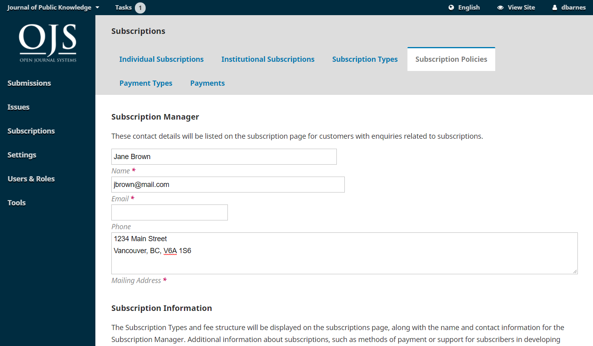
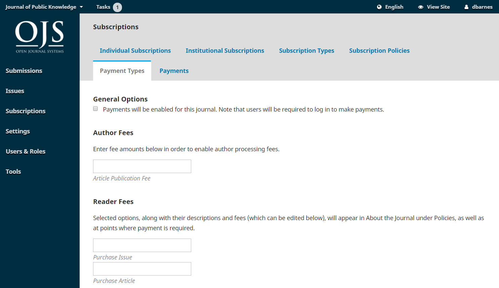
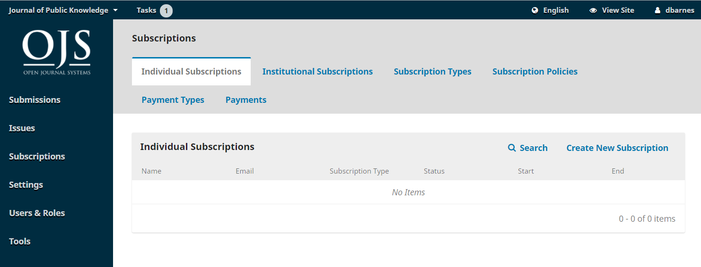
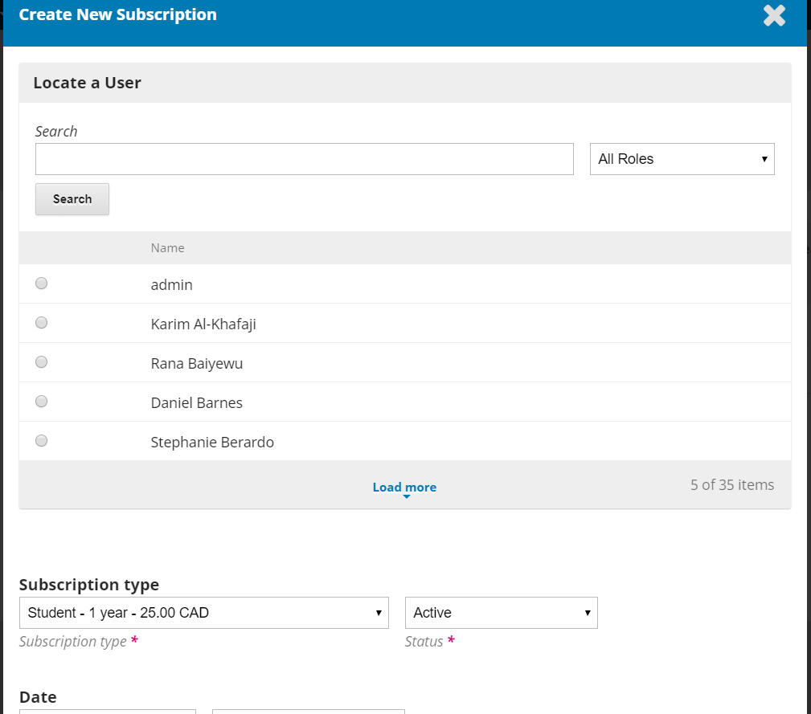
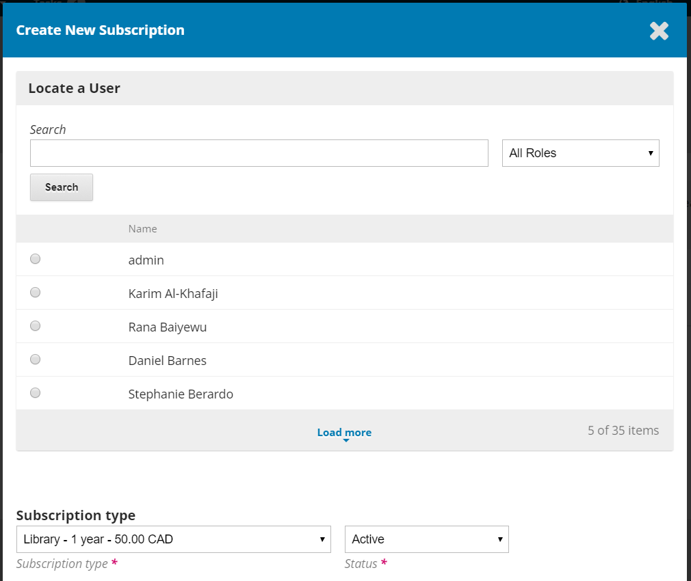
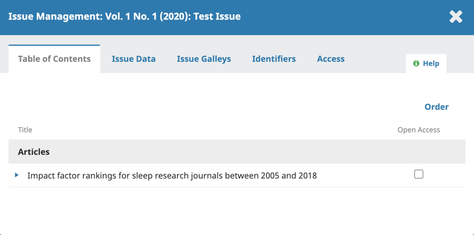

# Abonnements

OJS vous permet de restreindre l'accés à tout ou juste une partie de votre contenu aux abonnés. Pour activer les Abonnements, accédez d'abord à [Paramètres > Distribution > Accès](./distribution_settings.md) .

## Subscription Policies

Fill in details about your subscription policies on this page.

- **Subscription Manager**: Add personal details for the responsible person.
- **Subscription Information**: Add policy details to display on the journal website.
- **Subscription Expiry**: Determine whether past subscribers should continue to have access to older content.
- **Subscription Expiry Reminder**: Configure automated renewal reminders.
- **Online Payment Notifications**: Keep the Subscription Manager informed of payment activities.
- **Open Access Options for Subscription Journals**: If appropriate select the number of current months for restricting access. Older content will be automatically made open.

## Types d'Abonnement

La prochaine étape de la configuration de la gestion des abonnements consiste à désigner les types d'abonnements proposés par la revue.

Les revues proposent généralement les prix pour des abonnements individuels et des abonnements institutionnels. Certaines revues peuvent proposer des offres spéciales aux membres d'une organisation ou aux étudiants. OJS soutiendra la gestion des abonnements imprimés et/ou en ligne. Plus d'un type d'abonnement peut être créé pour couvrir des périodes plus longues (12 mois, 36 mois).

Sélectionnez **Créer un Nouveau Type d'Abonnement** pour en ajouter un nouveau.

- **Nom du Type**: donnez à ce nouveau type d'abonnement un nom unique (par exemple, étudiant).
- **Description**: Fournissez une brève description qui apparaîtra sur le site Web.
- **Cost**: Select the currency type and amount.
- **Format** : choisissez le format approprié (par exemple, en ligne).
- **Durée**: entrez le nombre de mois que ce type d'abonnement couvrira (par exemple, 12).
- **Abonnements**: indiquez si ce type couvre les individus ou les institutions.
- **Options** : sélectionnez les options appropriées (si il y en a).

## Types de Paiement

Si vous ne l'avez pas déjà fait, allez dans [Paramètres > Distribution > Paiements](./distribution_settings.md) et définissez la devise et le mode de paiement appropriés (par exemple, PayPal).

Utilisez cette page pour définir les montants facturés pour différents types de frais.

### Author Fees

Si vous souhaitez facturer des frais de traitement d'article (Article Processing Charge -- APC) aux auteurs, saisissez le montant ici. Activer les frais d'auteur vous permettra de demander des frais de traitement d'article une fois le processus d'évaluation terminé. Lorsque l'article est accepté par l'éditeur/trice, l'éditeur/trice aura la possibilité d'exiger un paiement. Cela entraînera la réception d'une notification par l'auteur dans OJS et d'un email, qui le dirigera tout au long du processus de paiement.

### Reader Fees

Si vous souhaitez facturer des frais pour accéder à des articles et numéros individuels, vous pouvez saisir ici les prix des articles et numéros.

You can apply the fees to PDF files only by checking off "Only Restrict Access to PDF version of issues and articles".

Notez que pour vendre l'accès à un numéro, vous devrez télécharger une épreuve de numéros.

### Frais Généraux

Utilisez cela pour facturer d'autres frais, tels que les adhésions.

## Paiements

Au fur et à mesure que divers paiements sont reçus, ils seront répertoriés sous cet onglet.

## Abonnements Individuels

Tous les types d'abonnements individuels apparaîtront ici.

Vous pouvez créer un nouvel abonnement individuel à l'aide du lien Créer un Nouvel Abonnement. Cependant, vous devrez d'abord créer un nouveau compte pour cette personne sous Utilisateurs et Rôles (voir le[Chapitre Comptes d'Utilisateurs](/learning-ojs/en/user-accounts) ). Une fois que cela est fait, vous pouvez rechercher le compte ici et appliquer les différentes configurations.

**Type d'Abonnement**: sélectionnez le type approprié pour ce nouvel abonné (par exemple, étudiant) et son statut (par exemple, actif).

> Les Types d'Abonnement ont été configurés plus tôt dans ce chapitre.

**Date**: définissez les dates de début et de fin de cet abonnement.

**Adhésion**: si l'abonné est associé à des adhésions pertinentes, ajoutez ces informations ici (facultatif).

**Numéro de Référence**: si l'abonnement est associé à un numéro de référence pertinent (tel qu'un numéro de facture pour le paiement), ajoutez ces informations ici (facultatif).

**Notes**: If you have any relevant notes to add, record that information here (optional).

## Abonnements Institutionnels

Tous les types d'abonnements institutionnels apparaîtront ici.

Les abonnements institutionnels sont gérés de la même manière que les abonnements individuels, mais sont utilisés pour les bibliothèques, les instituts de recherche et autres organisations qui s'abonnent à votre revue.

Vous pouvez créer un nouvel abonnement individuel à l'aide du lien Créer un nouvel abonnement. Cependant, vous devrez d'abord créer un nouveau compte pour la personne qui le point de contact avec l'institution sous Utilisateurs et Rôles (voir le[Chapitre Comptes d'Utilisateurs](/learning-ojs/en/user-accounts) ). Une fois que cela est fait, vous pouvez rechercher le compte ici et appliquer les différentes configurations.

- **Type d'Abonnement**: sélectionnez le type approprié pour ce nouvel abonné (par exemple, Bibliothèque) et son statut (par exemple, Actif). (Les types d'abonnement ont été configurés plus tôt dans ce chapitre.)
- **Date**: définissez les dates de début et de fin de cet abonnement.
- **Institution**: Add the name of the institution for this subscription (e.g., Simon Fraser University Library).
- **Mailing Address**: Add the address of the institution.
- **Domaine**: les lecteurs provenant d'un ordinateur avec ce domaine recevront automatiquement l'accès (par exemple, sfu.ca). Cela s'appliquera aux utilisateurs sur le campus.
- **IP Ranges**: The institution may provide you with IP ranges. Readers using a computer in this IP range will automatically receive access. Each IP range should be entered as a new line.

- **Notes**: If you have any relevant notes to add, record that information here (optional).

## Bloc d'Abonnement

Lorsqu'un utilisateur a accès à un site ou à son contenu via un abonnement, les informations de l'abonné fournissant l'accès peuvent être affichées dans la barre latérale. La fonction de Bloc d'Abonnement doit être sélectionnée pour être affichée dans Paramètres du Site Web > Apparence > Gestion de la barre latérale.

## Définir les Articles à Accès Ouvert

Si vous souhaitez définir certains articles comme Accès Ouvert, cela peut être fait en allant à **Numéros** dans le menu de gauche. Si vous souhaitez cela définir avant de publier le numéro, cliquez sur l'onglet Futur suivi de la flèche bleue à côté du numéro.

Sous la Table des Matières, cochez les articles qui seront définis comme Accès Ouvert.

