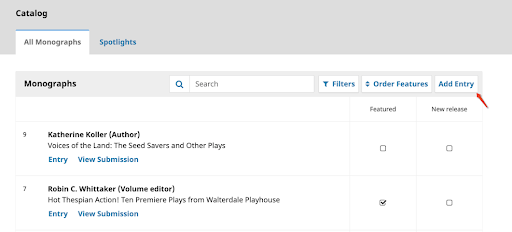
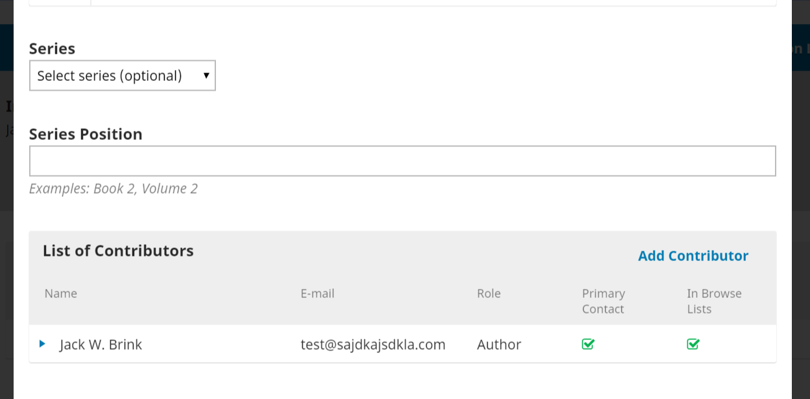

# Catalog Management

This chapter is about managing your press’ catalog, or the grouping of books that are available in various formats to the reading public located off the press home page, and displaying your published content for easy reader access.

As the Press Manager or Editor, you can manage your catalog in a number of ways. OMP includes an overall Catalog Management interface that you can find on your left menu panel. You will also find a Catalog Entry tool for each individual submission on each submission page.

Authors may also assign their original submissions to various categories and series, and editors can change these assignments at any time.

## Create a new catalog entry

You can create a new entry from the list of submissions in Catalog > All Monographs by clicking ‘Add Entry’ on the main panel submenu.

Select the submission(s) you want to add to the catalog and click ‘Add Selected to Catalog.’

#### Create a catalog entry for a chapter

To create a catalog entry for a chapter:
1. Open the **Catalog Entry** link on the top right of the page
2. Scroll down to Chapters on the Monograph tab and click **Add Chapter**
3. Enter the metadata for the chapter, including a Title
4. Under Files select the file you uploaded for the chapter under **Publication Formats**
5. Click **Save**

#### Create a catalog entry within a manuscript submission

To create a catalog entry within the submission of a manuscript:
1. Click Catalog Entry on the top-right corner of the submission
2. Click Catalog in the pop-up box
3. Click the checkbox to Add this to the public catalog

## Select Featured and New Release entries

In Catalog > All Monographs you will see checkboxes beside each catalog entry that will allow you to designate it as a Featured Entry or a New Submission.

When you select either of these checkboxes, the entry will appear under a special section on the homepage for “Featured” and “New” monographs.

If you don't see the entry appear, make sure you have enabled them on the Homepage Content setting under Website Settings > Appearance.

To configure the number of Featured and New monographs displayed on the homepage, you can adjust the numbers for Lists - Items per Page under Website Settings > Appearance.

You can reorder Featured entries using the Order link at the top of the grid. New Releases will appear with the latest first.

*Features and New Releases can be highlighted on the Category and Series pages of your catalog as well. To do so, browse to the Category or Series tab.*

## Manage Spotlights

Spotlights allow you to select a few books to be displayed prominently on the homepage along with a custom title and description.

This is useful when you want to promote a book with marketing language that goes beyond the book's title and abstract, such as highlighting praise a publication has received.

To select, add, or edit your spotlight go to Catalog > Spotlights.

## Author Browse Lists

### How to include authors in browse lists.

All contributors listed for each manuscript will be displayed in the monograph’s summary page.

When entering contributors, the submitting author will have the option to include all other contributors in the browse list.

Selecting to include contributors means that their name will be displayed in the press’ home (if selected as a new release or feature), series, or category page.

### Highlight author who is an editor of the volume

To highlight an author who is also the editor of the volume, the submitting author must indicate their role accordingly when entering them in the list of contributors.

If this role is not being displayed in your press, please check your User & Role settings (Users & Roles > Roles > Arrow on Volume Editor > Edit > Role Options)

## Add Books to Series

Series can be used to help organize your publications into a special set of books devoted to a theme or topic. See [Press Settings](./press-setup.md#press-settings) for instructions on how to create and edit series.

To add a book to a series:

1. Go to the book’s submission page and click **Metadata** in the top right. A form to view and edit the book’s metadata will open
2. Scroll down to **Series** and select the series you want to add the book to from the drop-down list
3. Fill in the **Series Position** field below if you want to indicate where the book fits into the series
4. Click **Save**

## Add Books to Categories

Categories can be used to organize your books into thematic collections and provide another way for readers to access your content. For instructions on how to create categories, see [Press Settings](./press-setup.md#press-settings). You can add a book to a category by editing its metadata.

1. Go to the book’s submission page and click **Metadata** in the top right. A form to view and edit the book’s metadata will open
2. Scroll down to the Categories section and check off the category or categories you want to add the book to
3. Click Save
