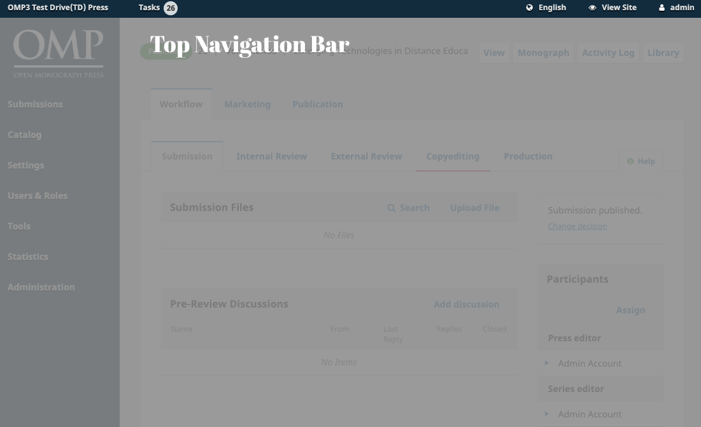

# Editorial Interface

OMP 3.2 has a separate interface once you log into the editorial system. This makes it easier to customize the reader interface.

The editorial interface is known as your dashboard and consists of the following elements:

1.__Top Navigation Bar__: To the left, you will find the name of the press with which you are currently working (e.g., OMP3 Test Drive (TD) Press. If you are enrolled in more than one press on your OMP installation, you can use this to switch between presses. Next to that are your Tasks (items needing immediate attention). To the right, you can switch languages if the press is multilingual, view the reader interface, or click on your username to view your profile or logout.

2.__Left Menu Panel__: These are the major sections of the dashboard, including the submissions, catalog, settings, user and role management, tools, and statistics. Users with fewer permissions (e.g., Authors, Reviewers, Copyeditors, etc.) will see fewer options here.

3.__Metadata Bar__: This shows information about the manuscript. On the left is status, manuscript number, author, title. On the right are additional buttons that will allow you to preview the manuscript page once it’s published, and see the submission type (e.g. monograph, edited volume), activity log, and document library. "In the image above, you'll notice that the status is "Published," the manuscript number is 22, the author is Veletsianos, etc."

4.__Main Panel__: In the main panel you will see the area of the workflow you are working in. In the image above, you are looking at Copyediting stage of the editorial workflow, as indicated by the red line under.

5.__Main Panel Submenus__: Within the Main Panel, you will often see tabs that allow you to view various information about the area in which you are currently working. In this example, the submission record is broken into five sections (Submission, Internal Review, External Review, Copyediting, Production). Notice the Help tab to the right, which provides context-sensitive help for the page you are currently viewing.

6.__Right Panel__: From here, you can see the action buttons, such as Send to Internal Review. Different pages have different action buttons or decision notifications. Below the action button or decision notification is the Participants table, which lists everyone (except Reviewers) involved in the submission. In the image above the action buttons are not shown as it has been published. 

