# Setting up and Maintaining Your Server

## Server Settings

This area is composed of four sections: Masthead, Contact, Sections, and Categories.

### Masthead

#### Preprint Server Identity

This section allows configuring basic information about your preprint server, such as the title, initials, abbreviation and sponsoring information, if any.

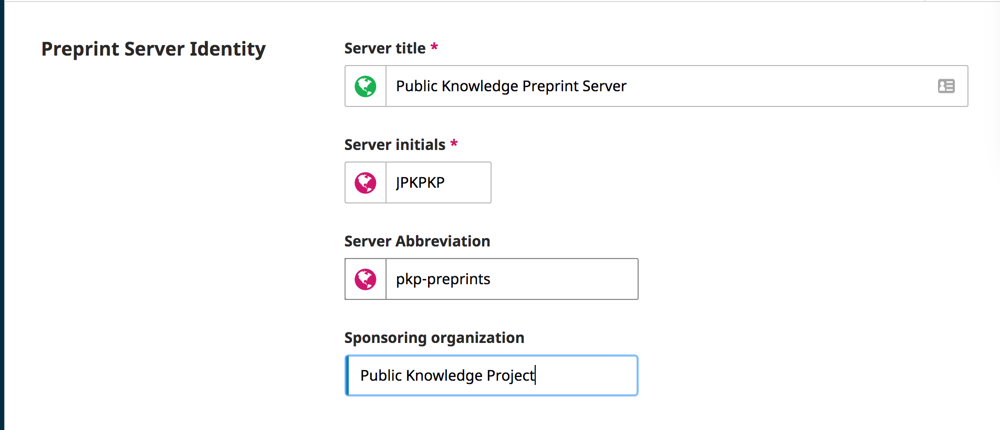

#### Key Information

The **Key Information** field allows you to provide a description of your server, such as what particular disciplinary areas your server’s preprints are focused in, as well as another field on the key participants for your preprints (e.g. editors, support contacts, etc.). The information added in the “Server Summary” box will only appear in the home page if you are running a multiple server site. If you are running a single server site, this information is irrelevant.

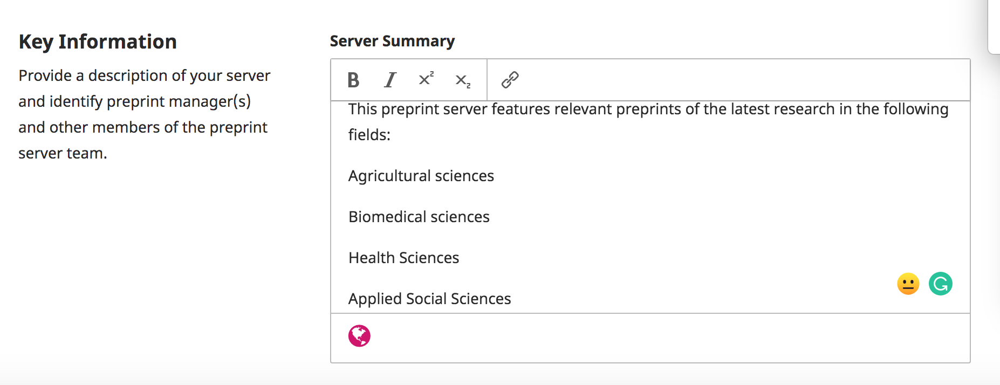

The **Description** provides an overview of the preprint server and appears on the Public About page, providing your server’s visitors with a concise description of your preprint server.

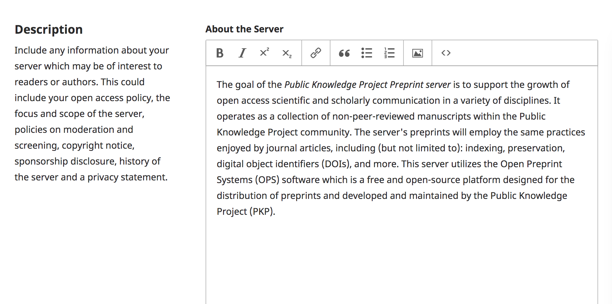

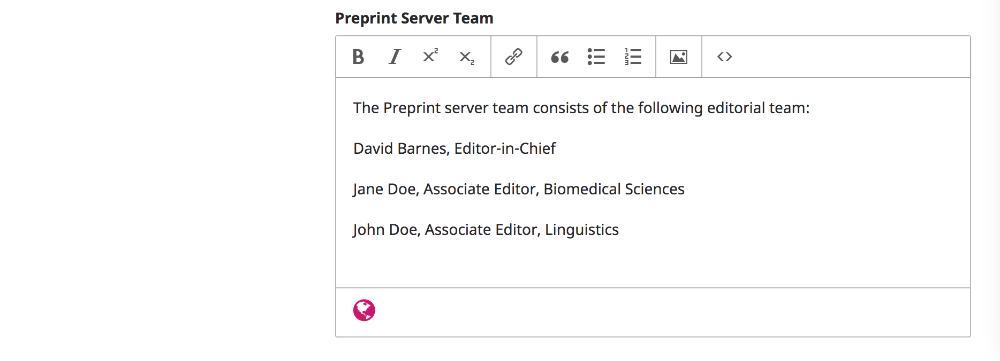

Note that the terminology may be different for OPS, with some slight modifications. For example, a Moderator would be the equivalent of a Journal Manager and a Preprint server library is equivalent to the Publisher Library. 

### Contact

#### Principal and Technical Support Contacts

The information added here will be available publicly in the “Contact” page. It can also be used to populate email templates, using the email tag `{$editorialContactSignature}`

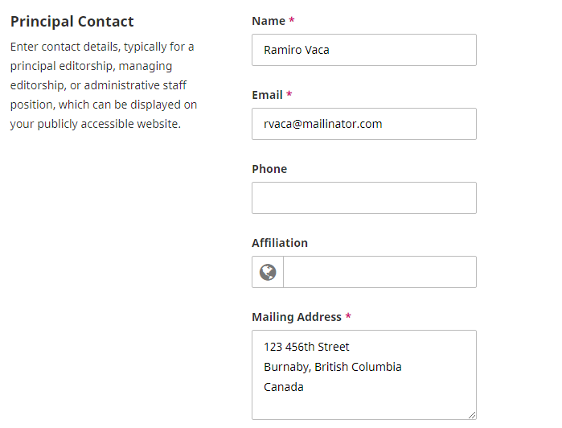

### Sections

This area allows the creation and management of sections. Sections are not used in OPS the way they are used in OJS because in OPS you do not publish issues and posted preprints are not organized by sections. Categories are used to organize preprints instead. However, a preprint server can still use sections to have different policies, rules and moderators for different collections of preprints.

One use case for sections is using them to classify preprints in different disciplines or document types. One caveat to keep in mind, however, is that there can be only one section per submission/preprint.

Multiple sections can be created and multiple moderators can be assigned to each of them. Any moderator assigned to a given section will be automatically assigned to all submissions made to that specific section.

Instructions on how to create, edit, and manage sections is in [Learning OJS 3](/learning-ojs/en/journal-setup#sections).

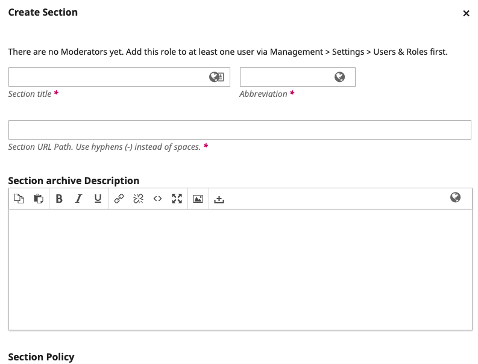

### Categories

This area allows for the creation and management of categories, which is another way to classify and categorize preprints in OPS. One use case for categories is using them to classify preprints in different disciplines of knowledge. Unlike sections, there can be multiple categories associated with a submission/preprint.

Instructions on how to create, edit, and manage categories is in [Learning OJS 3](/learning-ojs/en/journal-setup#categories). Here’s an example of what adding a new category looks like:

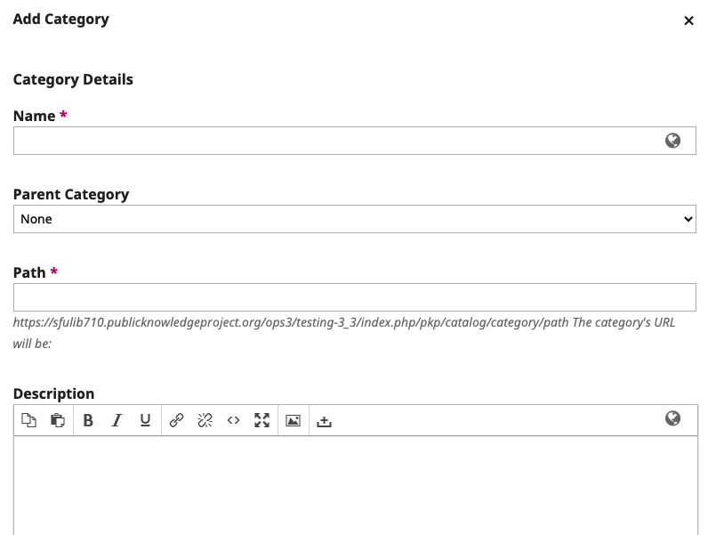

Another difference between sections and categories is the ability of having sub-categories associated to a parent category, as seen below:


OPS is flexible enough to allow a preprint server to work with a combination of multiple Sections and Categories or singularly work using only sections or only categories, depending on your editorial policies and workflow.

This is what will appear to the author during the submission process:

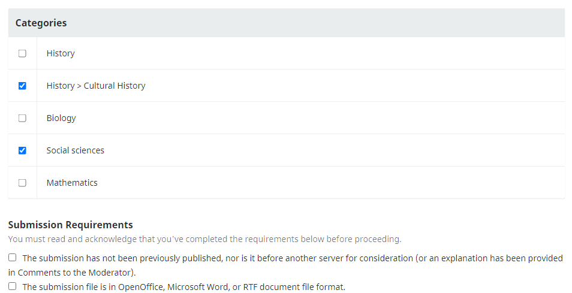

## Website Settings

The Website settings in OPS are very comparable to OJS/OMP. For an overview of this, please consult the [Learning OJS guide section on website settings](/learning-ojs/en/settings-website).

One key option in Website settings that differs in OPS from OJS/OMP is the ability to show the server summary in the homepage by selecting a checkbox.

Note that the theming options for OPS are currently limited to the Default theme. Should you wish to develop additional themes, please consult the [PKP Theming guide](/pkp-theming-guide/en/).

Additionally, there is currently only one sidebar block available in the settings - Language Toggle. If this option is added, the layout of the site changes to accommodate the sidebar.

In the “Advanced settings” you can add several customizable options, such as a CSS stylesheet, a favicon, and additional content that will appear on the website. Please refer to the [Designing your Journal guide](/designing-your-journal/en/) for additional guidance on customizing the appearance of your OPS site.

### Plugins

The Plugins tab under Website Settings lists pre-installed plugins under Installed Plugins and additional plugins under Plugin Gallery. See [Learning OJS](/learning-ojs/en/settings-website#installed-plugins) for information about how to install and use plugins. The list below highlights the plugins that are especially useful for OPS.

**AddThis**: This plugin allows adding social media sharing buttons to the preprint landing page. For a better usage, it is recommended to register an account at AddThis.

**Browse Plugin**: This plugin adds the ability to browse by Categories and sub-categories through the Servers homepage. To configure this plugin, please refer to [Plugin Section of OPS]().

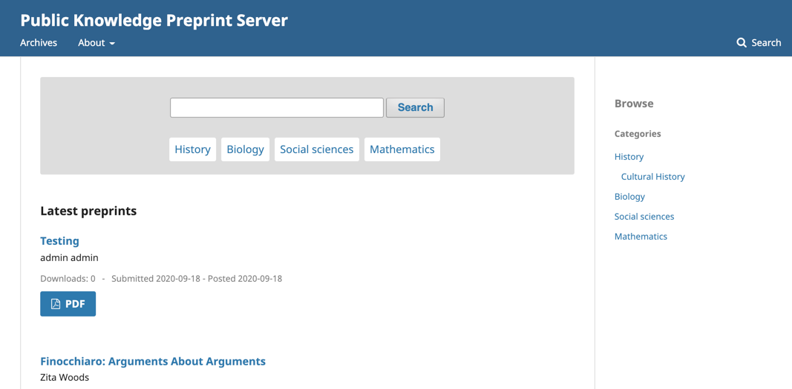

**Crossref Deposit Plugin**: This plugin is necessary to register preprints DOIs at Crossref. When enabled, it will automatically deposit the Preprint DOI during the post action.

**DOI**: This plugin allows assigning DOIs for preprints. Preprint and final article will have different DOIs but you can connect them in the Publication record. In order to use it, a subscription to a DOI provider service is required.

**Google Scholar Indexing Plugin**: This plugin enables indexing of published content in Google Scholar.

**Hypothesis**: This plugin allows users to comment on preprints, as sort of an open review process. It has been adapted for OPS to work also on PDFs.

**ORCID Profile**: This plugin allows authors to associate their ORCID ID using ORCID’s public or member API. In order to use it, the institution responsible for the preprint server must request credentials to ORCID. Please refer to this [ORCID Guide](/orcid/) on how to install and configure this plugin.

**Returning Author Plugin**: Typically, all new submissions will be checked by a moderator before being published on the server (see the [Editorial Workflow section of this guide](./editorial-workflow)). The Returning Author Plugin will permit authors who already have at least one published submission to self-publish subsequent submissions, without the need for a moderator to confirm the submission.

## Workflow Settings

The workflow settings in OPS are very comparable to OJS/OMP. For an overview of this, please consult the [Learning OJS guide section on workflow settings](/learning-ojs/en/settings-workflow).

### Screening policies and plugins

As OPS does not use other aspects of the review process available in OJS, server managers will need to decide on a policy and practice for screening submissions to prevent spam from being ingested into the server. Author screening plugins can be used to facilitate this process, and will appear under Submission >Author Screening Plugins in the Workflow Settings when enabled. See the section on Plugins in the [Website Settings chapter](./setup#plugins) for information about the Returning Author Plugin and the Control Public Files Plugin.

The Checklist and the Author Guidelines tabs should be populated with details about the types of submissions that are acceptable and the specifications for formatting, layout, and copyright.

### Keywords

In OPS there is an option to enable standard Keyword Metadata and to additionally configure whether the author can provide or must provide their own keywords during submission.


## Distribution Settings

The distribution settings in OPS are very comparable to OJS/OMP. For an overview of this, please consult the [Learning OJS guide section on distribution settings](/learning-ojs/en/settings-distribution). OPS does not have the payment or archiving settings that you will find in OJS. The information provided below is what will be relevant to OPS.

### License

In this section you can configure copyright and licensing terms for your server’s content. Copyright can be retained by authors, assigned to the server, or assigned elsewhere through a custom copyright statement. If you select a Custom copyright statement, a new field will appear for you to specify where or to whom the copyright will be assigned.

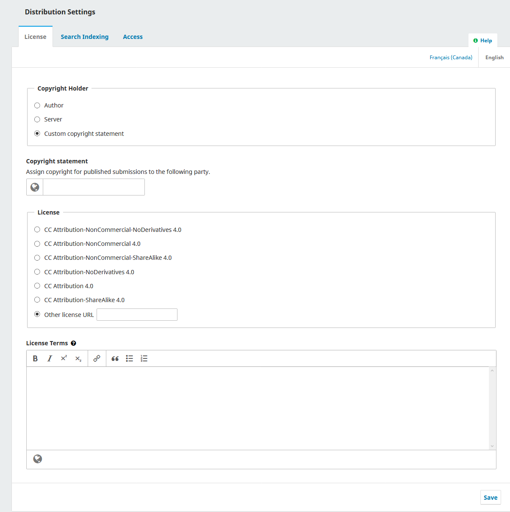

### Search Indexing

This section helps you enhance your search engine optimization and make your content more discoverable.

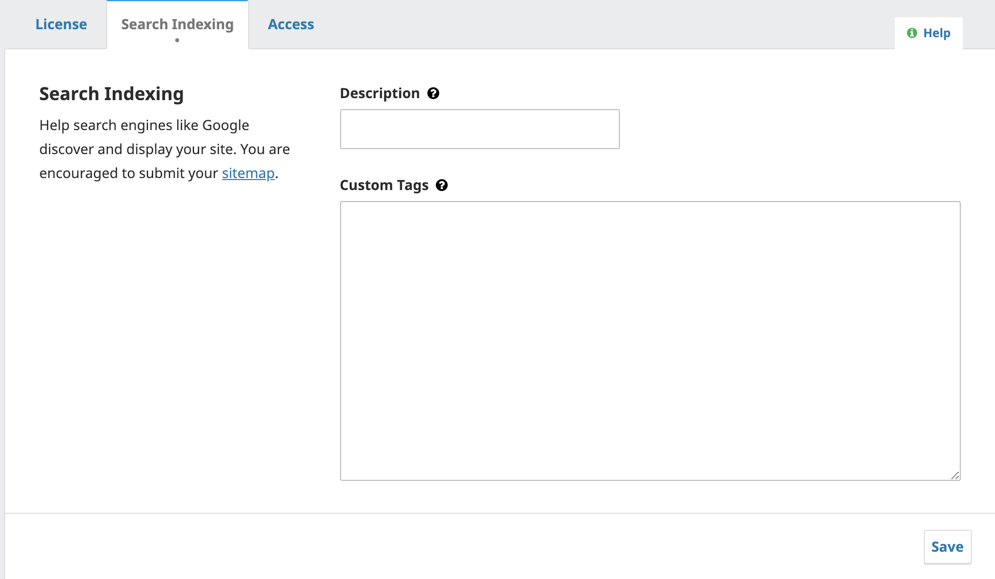

Use **Description** to provide a brief description of your server for search engines.
Use **Custom Tags** to add custom HTML header tags to the header of every page of your server, which can help your site get indexed by search engines. Tags need to be added as HTML elements. If you simply enter words they will appear at the top of every page of your site instead of in the site’s metadata. Here is an example of text that could be entered in this field:

```xml
<meta name="description" content="Public Knowledge Preprint Server" />
<meta name="keywords" content="open access, scholarly publishing, open source software, non-profit organizations, scholarly journals, free software" />
<meta name="author" content="metatags generator">
<meta name="robots" content="index, follow">
<meta name="revisit-after" content="3 month">
```

### Access

#### Publishing Mode

Under publishing mode you can indicate whether the content on the preprint server will be available by open access or if it will not be made available online.

#### Enable OAI

Enable OAI will be enabled by default, as this is an important protocol used by indexing services and other applications to harvest your server’s metadata. If you are not publishing content online, you may want to disable this.


