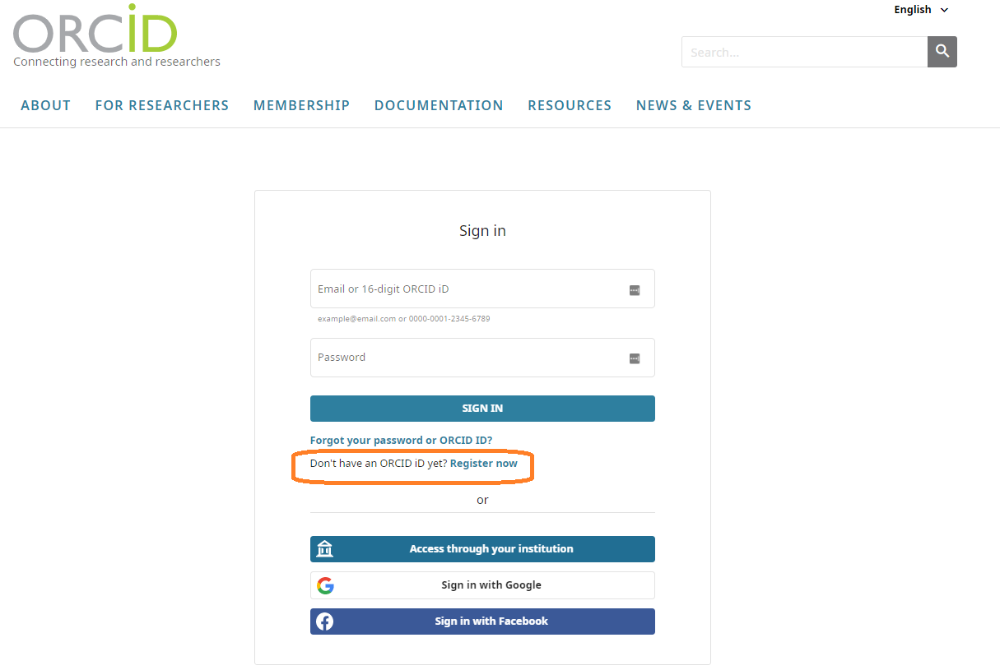
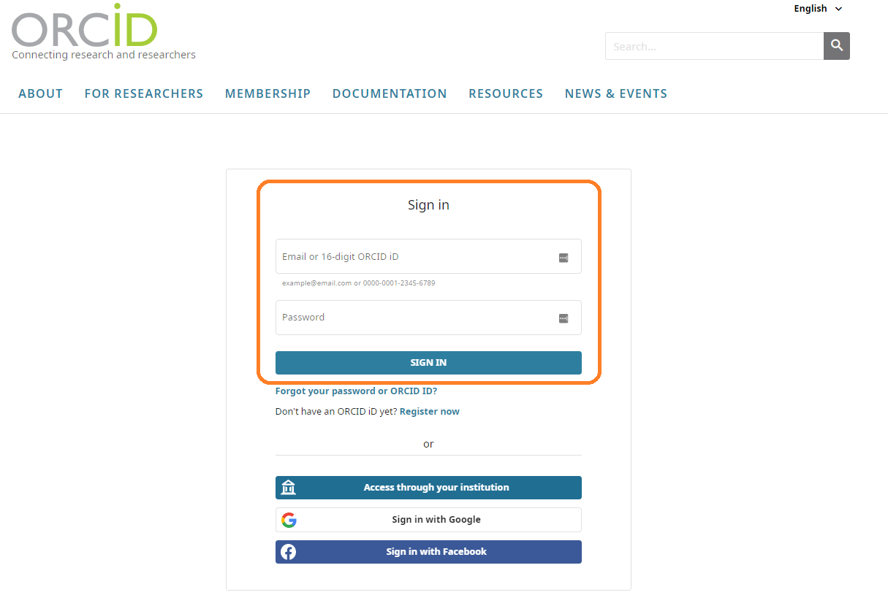
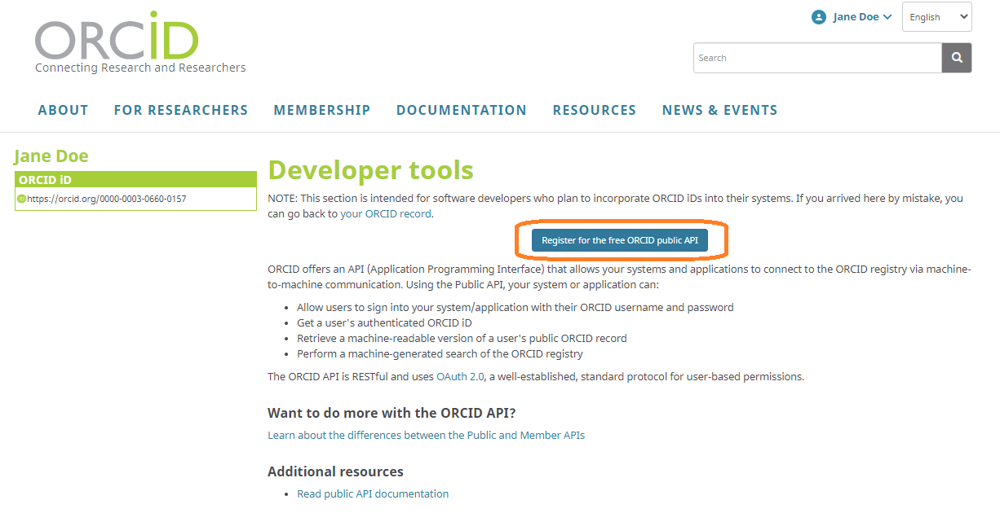
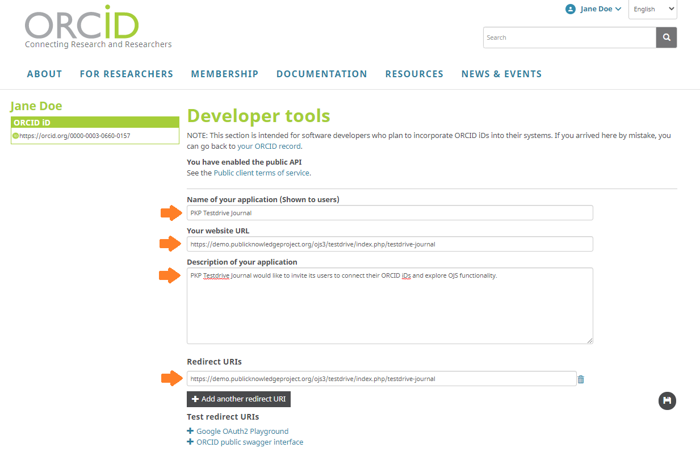
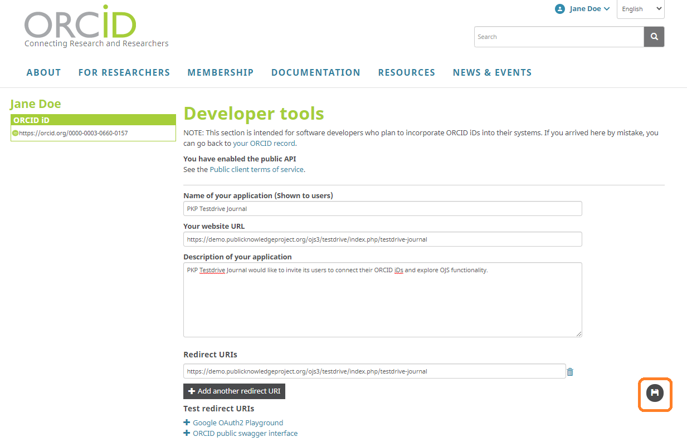
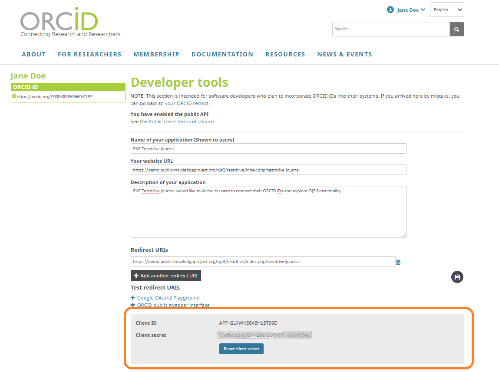
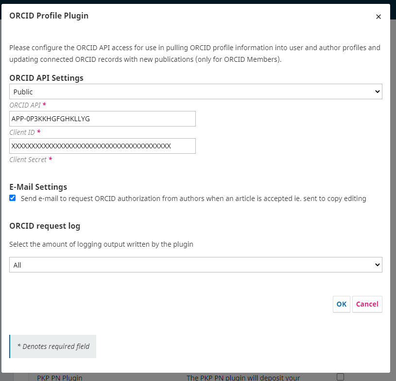
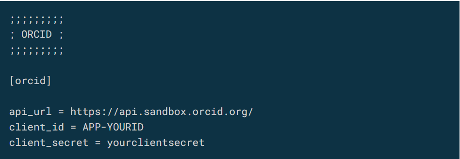

# Setup the ORCID plugin

To use the plugin, you will first need to obtain either Public or Member ORCID API credentials (Client ID and Client Secret) and then configure the ORCID Profile Plugin in OJS/OPS with this information. 

This chapter explains how to obtain production (live) credentials and add them to the ORCID plugin in your OJS/OPS. We recommend that before using the live credentials, you test the plugin with Sandbox credentials first. For details on how to do that see the [Appendix: Testing the ORCID Sandbox](./appendix-testing-orcid-sandbox.md) chapter.

**IMPORTANT: do not enable the plugin until you have the credentials and are ready to setup the plugin.**

## Request Public API credentials

### 1. Register for an ORCID iD

ORCID iD registration is free and only requires your name and email.

If you already have an ORCID iD, skip to [2. Sign into your ORCID iD](#sign-into-your-orcid-id).

1.  Navigate to [https://orcid.org/](https://orcid.org/)
2.  Click on [SIGN IN / REGISTER](https://orcid.org/signin) menu on top right
    

3.  Create an account with your email or sign in with your institutional account (if your institution is set up for ORCID single sign on).
    
    
  
4.  If you need further registration guidance, the [Register your ORCID page](https://support.orcid.org/hc/en-us/articles/360006897454-Register-your-ORCID-iD) contains detailed step by step instructions.
    
### 2. Sign into your ORCID iD

1.  Navigate to [https://orcid.org/](https://orcid.org/)
    
2.  Click on [SIGN IN / REGISTER](https://orcid.org/signin) menu on top right
    
3.  Sign in with your existing email account or via your institutional credentials (if your institution is set up for ORCID single sign on)
    
  
 
### 3. Navigate to Developer Tools

Click on your name on top right and select “Developer Tools” from the drop-down.
  

### 4. Select to register for the Public API

Click on the button “Register for the free ORCID public API”.

You will be asked to read and consent to the terms of service.

  

### 5. Fill out the registration form

 In the registration form, enter:

* Your journal name
* Your journal URL
* A brief message about your journal - it will be displayed to your users when they connect their ORCID iDs
* Redirect URI - this is the page your users will be taken to after they have authenticated their ORCID iDs. It must begin with “https://” and include the link to the journal. For details and examples see the [ORCID redirect URIs section](#orcid-redirect-uris) below. 

### 6. Save the form and receive your credentials

1.  Click on the save icon on bottom right to save the form.
    

2.  Your credentials (Client ID and Client Secret) will be displayed right away. 
Copy these credentials into the OJS/OPS ORCID Profile Plugin as explained below.

## Request Member API credentials

Member API credentials are connected to an ORCID member organization. Your organization must be an ORCID member to request Member API credentials. If your journal is affiliated with an institution, contact the institution's library to ask about ORCID membership and API credentials. You may also wish to check whether your organization belongs to a [local consortium](https://orcid.org/consortia), as you may be able to receive help from the consortium. You can also contact ORCID directly at support@orcid.org.

To request your Member API credentials, complete the form to [Register a client application: Production Member API - Trusted Party](https://orcid.org/content/register-client-application-production-trusted-party). Once you submit the form, ORCID will email your production member Client ID and Client Secret to you.

### ORCID redirect URIs

When you register for ORCID API credentials, you will need to enter at least one Redirect URI, which is the journal location that your users will be sent to after authorizing OJS/OPS to connect to their ORCID record, The URI must begin with “https://” and include the link to the journal as part of the URI. For example:

* This works (for example, for a multi-journal installation): https://example.com
* This works (for a single journal): https://example.com/index.php/testJournal
* This does NOT work: https://example.com/index.php/testJournal/index

The host option allows any URI under that host to be used as a Redirect URI. In multiple journal instances, make sure you choose the base url of your domain and not individual journals to avoid redirect errors. For individual journals it is important to use the journal path (typically something like “index.php/testJournal”, without any trailing information, as per above). Any additional information in the URI will cause the redirect to not work.

For more detail on Redirect URIs, see the ORCID support page for [Public APIs](https://support.orcid.org/hc/en-us/articles/360006897174-Register-a-public-API-client-application) and [Member APIs](https://support.orcid.org/hc/en-us/articles/360006973913), respectively, and the [Redirect URI thread on PKP Forum](https://forum.pkp.sfu.ca/t/orcid-oauth2-redirect-uris-or-callback-urls-for-ojs).

**Please note**: When registering to receive Member API credentials, organizations are required to indicate the "Client Name" along with the Redirect URI(s). When working with multiple journals as part of an OJS instance, the Client Name used must be broad enough to serve as a source for all of the journals hosted on its instance(s), as the Client Name is what will appear as the "source" of data when a work from OJS is written to an ORCID record (e.g. “ABC University journal hosting service”). However, if you plan to install only one journal in your domain and use  ORCID for that journal, then the Client Name can be indicated as the name of the journal.

When registering for Sandbox or [Production Member API](https://orcid.org/content/register-client-application-production-trusted-party) credentials through ORCID, although there appears to be a limit of five redirects, you can add as many as you like to the ‘notes to ORCID’ section. If you ever need to adjust, add, or remove URIs, you can resubmit the form and indicate that it is for an existing application.

## Enable and configure the ORCID Profile plugin in OJS/OPS

After you have obtained your Client ID and Client Secret from ORCID, you can enable and configure the plugin in OJS/OPS.

First, enable the ORCID plugin for each journal (OJS) or preprint server (OPS) on your installation:

1. When logged in to OJS/OPS as an administrator, go to Settings > Website > Plugins
2. Click on Plugin Gallery and select ORCID Profile from the list

There are three potential scenarios for configuring the plugin, based on your use case:

1. If you have a single journal or preprint server installation, configure the plugin following the instructions below under Per Journal/Preprint Server Setup.
2. If you have a multi-journal or multi-preprint server installation, but you do not want to enable the ORCID plugin for all, configure each journal or preprint server separately following the instructions below under Per Journal/Preprint Server Setup, using the same ORCID API credentials (Client ID and Client Secret) for each.
3. If you have a multi-journal or multi-preprint server installation and want to enable the ORCID plugin for all site-wide, follow the [instructions below under Site-wide Setup](#site-wide-setup).

### Per Journal/Preprint Server Setup

If you want to enable the ORCID plugin for a single journal (OJS) or preprint server (OPS):

1. When logged in to OJS/OPS as an administrator, go to Settings > Website > Plugins
2. Under Installed Plugins find the ORCID plugin
3. Check the checkbox to enable to plugin
4. Click the blue arrow to the left of the plugin name to make “Settings” appear, then open Settings. Enter information about your ORCID API credentials.

For a visual walkthrough see this [ORCID plugin setup video](https://vimeo.com/374414746).

#### Email Settings

Under “E-Mail Settings” you can tick the checkbox to “Send e-mail to request ORCID authorization from authors when an article is accepted.” If checked, OJS/OPS will send an email automatically to authors who have not already linked their ORCID iDs when the article is published asking them to link their iDs. This request will be sent using the “ORCID Collect Author Id” email template (Public API) or “ORCID Request Author Authorization” (Member API).

### Site-wide Setup

For multi-journal and multi-preprint server installations the plugin can be set site-wide in `config.inc.php` to enable the ORCID plugin for all journals. Note that site-wide settings through `config.inc.php` override any existing individual plugin settings. However, the plugin can be enabled/disabled on an individual basis for journals, and each journal can manage their own email settings as described above. Adding credentials in the config.inc.php hides the Client Secret from Journal/Server Managers, which may be preferred if you have institutional credentials for ORCID. Add the following section to your config.inc.php file:

Note that the `api_url` needs to end with a slash.
