# Translate PKP Documentation

PKP uses a different tool for translating documentation called GitLocalize, which is compatible with markdown files, integrated with GitHub, and designed for translating longer pieces of text - and so better suited for translating documentation than Weblate. This chapter explains how to use GitLocalize, find documentation to translate, translate documentation, and maintain translations.

You can translate documentation directly in GitHub without using GitLocalize and the section “Translate without GitLocalize” explains how to do that, but we still recommend reading this chapter to understand how documentation translation works as a whole.

## PKP Documentation

PKP creates and maintains many different guides on using, administering, and developing PKP software applications, as well as other guides about scholarly publishing. Our published documentation can be found in the [PKP Docs Hub](https://docs.pkp.sfu.ca).

Documentation is coordinated, created, and maintained by the Documentation Interest Group, as well as other PKP staff and community members. We are always improving documentation - from creating new guides to updating documentation as the software and its features change.

All of our documentation is created and updated in the [pkp-docs GitHub repository](https://github.com/pkp/pkp-docs) in markdown files and rendered into web pages in the Docs Hub using a tool called Jekyll. You do not need to have any knowledge of these tools to translate documentation.

Most of our documentation is created in English and then translated into other languages, but original documentation in other languages is welcome. If you would like to create and update documentation or are just interested in learning more about how documentation works, check out our [Guidelines for Contributing to PKP Documentation](/contributing/en/) or contact us at documentation@publicknowledgeproject.org.

## Documentation Translation Workflow

Documentation translation is integrated with PKP software translation, and the workflow is similar. Translation of PKP software and documentation is done by PKP software users around the world. Translators can translate one guide or many.

PKP has a Translation Coordinator who coordinates translators and translations and approves and merges translations.

Larger language groups have a Language Moderator who coordinates translators and translations in that language and reports to the Translation Coordinator. The smaller language groups are coordinated directly by the Translation Coordinator.

Anyone with fluency in multiple languages and some understanding of the software and scholarly publishing context is welcome to contribute to translation. We especially appreciate translators who can commit to maintaining a translation over the long term. If you have multilingual fluency but no experience with our software, please use the documentation resources noted above to learn about our software before you start translating. Additional resources are noted below under **Choosing the Right Words.**

If you’re interested in being a Language Moderator for a particular language, please contact  [documentation@publicknowledgeproject.org](mailto:documentation@publicknowledgeproject.org). Language Moderators are required to make a minimum 2-year commitment to moderating the language. Language moderators should have excellent translation skills and knowledge of PKP software, as they are responsible for reviewing the approving translations. They should also have a relationship with and understanding of the user community for the language, so they can effectively coordinate and recruit translators.

## Get Started

To get started translating PKP software documentation, you can follow the instructions in this guide. If you have questions you can contact the Translation Coordinator or your Language Moderator. You can also talk to other PKP translators and ask questions in the [PKP Community Forum](https://forum.pkp.sfu.ca/c/translations/12).

To use GitLocalize for translation, you need to have a GitHub account and be logged in. If you do not already have an account, register on GitHub.

Once you are logged into GitHub, go to the [PKP Docs GitLocalize site](https://gitlocalize.com/repo/4035). You will need to give GitLocalize access to your GitHub account.

On the homepage, you will see a list of languages.

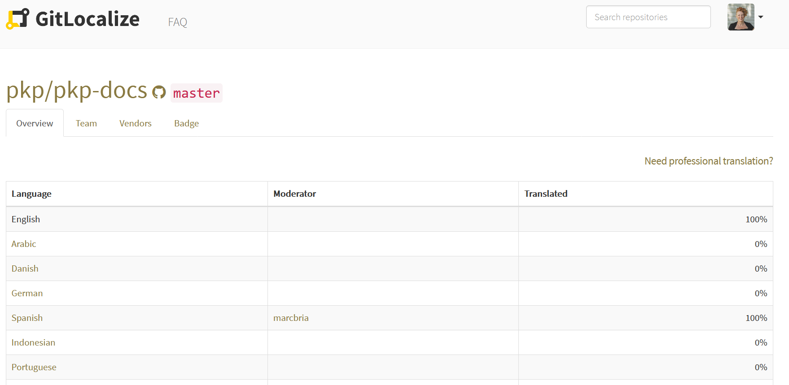

Click on the language that you want to translate into. In this example, it is Portuguese.

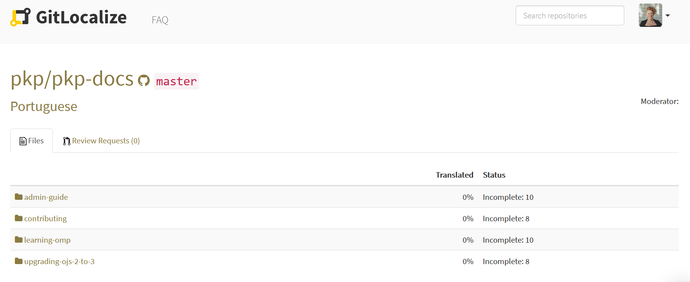

On the language page you will see a list of documents, and beside each document name, the percentage of the document that has been translated. The next step is to decide which document to translate.

### Choose a translation project

Consider the following when choosing a document to translate.

#### Documentation needs and priorities of your language group

Is there one document that would be more useful to other PKP software users who speak your language than others? If so, you may want to translate that document first.

You can ask the language moderator for your language if they know of any documentation needs or priorities for your language group. You can also inquire with regional user groups.

#### The size of translation project you want to do right now

Think about how much time you can commit to this current translation project. Once you begin a translation project, it is best to finish it within one or two weeks.

Documents vary in size. A few documents, like Learning OJS, have more than 10 chapters and some chapters are quite long. However, most documents have approximately 5 chapters that are 1-3 pages each.

Translation is done in chapter files and paragraphs, so you can choose to only translate a chapter or even only a few paragraphs in a chapter. You may find a document that is mostly translated and only needs a small part of it translated. However, if there is an entirely un-translated document, it is best if you can commit to translating the whole document or at least a thematic section of it. The translation will not be published until the entire document (all files/chapters) have been translated.

You can open each document to see how long it is and what parts of it need to be translated. When you first open the document, you will see the “en” folder and an index file.

Click the en folder to see all of the chapter files in the document.

Then open a chapter folder to see how long the chapter is and what parts need to be translated.

In this example you can see that the guide has not been translated yet.

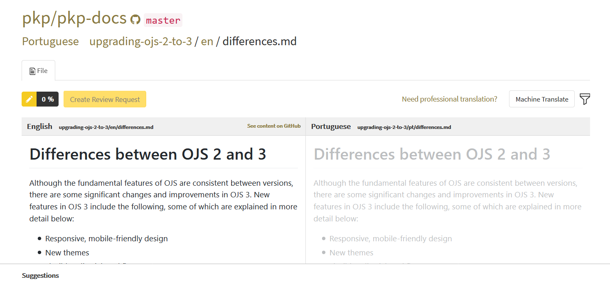

In this example the guide has been translated.

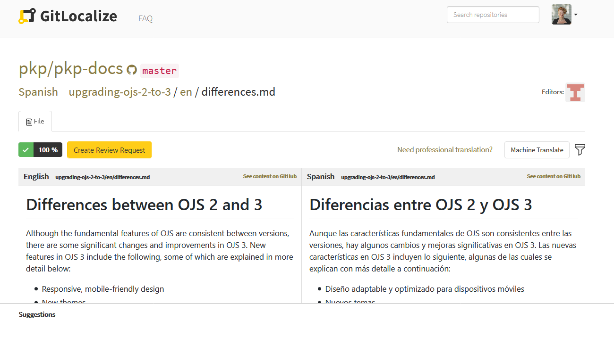

If there is a document that is completely or mostly untranslated, you can also open it in the [Docs Hub](https://docs.pkp.sfu.ca/index.html) to see how long it is and what content it contains.

### Start Translating

Once you decide on a project, you can start translating.

In GitLocalize, go to the folder for the language that you are translating into. Find the guide that you want to translate and open it.

Click the en folder to see all of the chapter files in the document. You will also need to translate the **Index** file in the main folder.

The chapter files will be listed in alphabetical order, but it might be easier for you to translate the files in their logical order. If so, you can open the guide in the [Docs Hub](https://docs.pkp.sfu.ca/index.html) to see what order the chapters are in and follow that order. 

Whichever order you decide to follow, open the file you want to translate first. You will see a split-view editor, with the original text on the left. GitLocalize breaks the files down into translatable segments, automatically links the translation with the version in the source language, highlighting the sections that are missing translations. 
If you click the text on the right, a text-editing box will appear with the original text in it. You can replace this text with translated text. Click **Submit** as you finish each part.

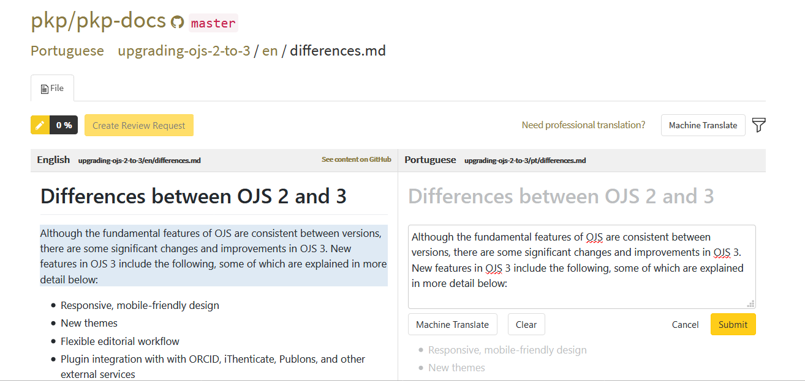

#### Machine translation

You can also use the machine translation tool to get machine translation assistance. 

If you click the **Machine Translate** button below the text box, GitLocalize’s machine translation tool will enter a suggested translation into the text box, which you can then edit. 

Or if you click the **Machine Translate** button on the top right of the page, machine translations will be entered in all of the text boxes that have not already been translated. This will take a few seconds. You can then edit them manually.

You may find that the machine translator will skip some sections, which you will have to translate manually or use an external machine translation tool.

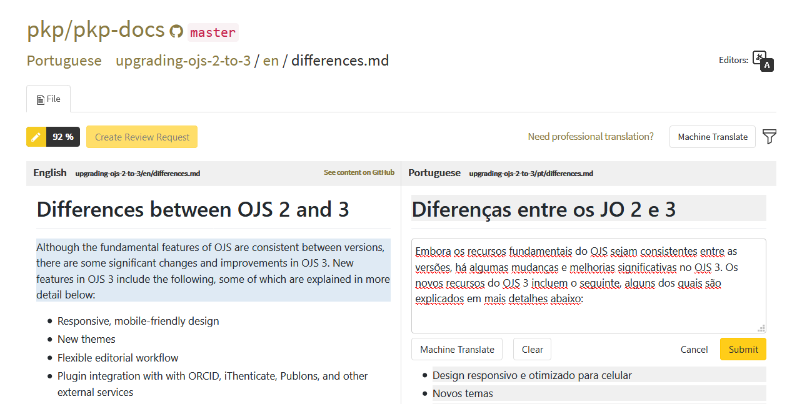

You will have to click **Submit** below each piece of text to confirm that the translation is complete. 

#### Choosing the right words

When translating software documentation, it's important to use terminology that is consistent with the software application and is commonly understood by users. There are a number of ways you can check this:
- Check an installation of the software that the guide is about (e.g., OJS) with the language you are translating the document into installed and enabled. PKP maintains test drive demo sites for [OJS](https://pkp.sfu.ca/ojs/ojs_demo/), [OMP](https://pkp.sfu.ca/omp/omp_demo/), and [OPS](https://pkp.sfu.ca/ops/demo/). If your language is not installed here and you need assistance accessing an installation in your language, you can [Contact PKP](https://pkp.sfu.ca/contact-us/). 
- PKP software translators maintain glossaries on a per-language basis of standard translations of technical terms. You can check the glossaries in the [software translation tool](https://translate.pkp.sfu.ca/dictionaries/pkp-lib/) on the language page, and if you create a Weblate account you can add terms to the glossary.
- You can post questions about terminology in the [PKP Community Forum](https://forum.pkp.sfu.ca/c/translations/12), which is a community discussion space for PKP translators. You will need to register to post a question.

#### Screenshots

You will see screenshots as you are translating, but you can ignore them. PKP is developing an automatic process to generate screenshots for translations.

<!--- You will see screenshots as you are translating. PKP is developing an automatic process to generate screenshots for translations. Until that is available, you are welcome to take screenshots of the software that will be added to the guide. Otherwise, English screenshots will be used until the other language screenshots are available.

To take screenshots you will need to have access to an installation of the software the guide is about (e.g., OJS) with the language you are translating the document into installed and enabled. [Contact PKP](https://pkp.sfu.ca/contact-us/) if you need assistance with this.

As you are translating the text in GitLocalize, as you come upon a screenshot, recreate the same scenario and take a similar screenshot on your installation. You can also open the English (or another language) version of the guide you are translating to see the existing screenshots. 

Save the screenshot with the same file name as the English screenshot (which you will see in the translation on the right), but add an abbreviation for your language at the end. For example, if you see the screenshot tag {img0 src="./assets/learning-ojs3.1-ed-tasks.png"} and you're translating into French, name your screenshot learning-ojs3.1-ed-tasks-fr.png. Then add the language abbreviation to the end of the file name in the image tag in Gitlocalize. E.g., {img0 src="./assets/learning-ojs3.1-ed-tasks-fr.png"} --->

### Create Review Request

When you have finished translating the chapter and clicked **Submit** below each piece of text, the next step is to request a review of the translation to the language moderator.

Click the Create Review Request button on the top left. This will open a form where you can leave comments about your translation. Note anything you were unsure about that you want the moderator to check in particular. Include any other comments that are relevant. 

Then click **Submit**.

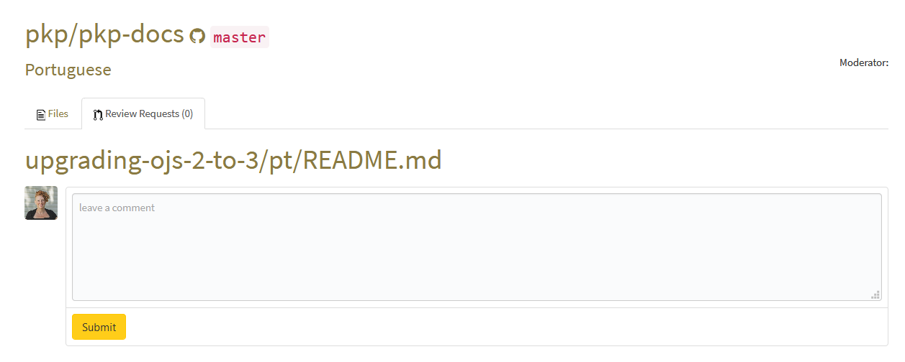

Now you will see a page where you can commit the changes, but you cannot actually take an action here unless you are a Moderator, so you are finished. 

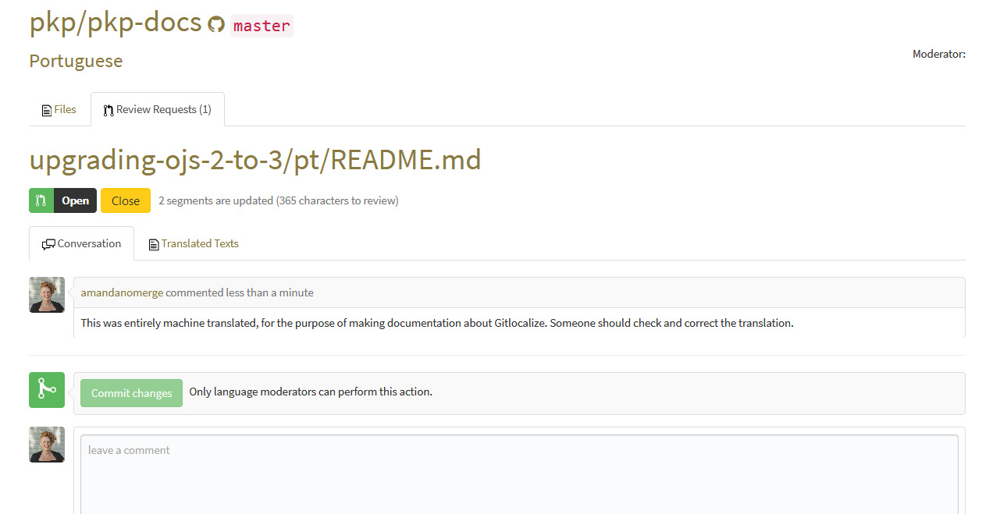

After the review has been completed and your translation merged, you will receive an email notification. The moderator may have questions or suggestions for your translation, in which case you will also receive an email notification.

Now you can translate another chapter! Click the language link to go back to the language folder and follow the steps above again, creating a new review request as you finish each chapter.

## Maintain or Update a Document Translation

After you complete a translation of a document, it is ideal if you can continue to maintain the translation as the document is changed and updated. Documents are updated when the software changes or when improvements and additions to the document are made. 

Once you translate a document, any time there is an update to that document it will get sent to GitLocalize and you will receive a notification of the update at the email address associated with your GitHub account. 

You can also visit GitLocalize to see if there have been updates that need to be translated, even if you did not do the original translation. If a document shows a percentage un-translated, there is probably an update that needs to be translated.

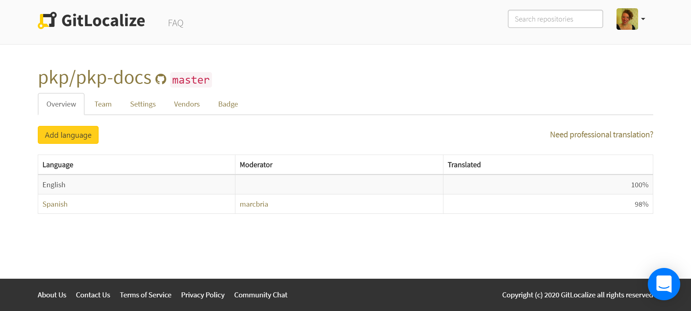

If the document shows a status of "Conflict," like in the example below, it probably means the document was translated outside of GitLocalize and so the relationships between the original text and translated text have not been defined. See the section below on "Update a Document Translated Outside of GitLocalize" for further information. 

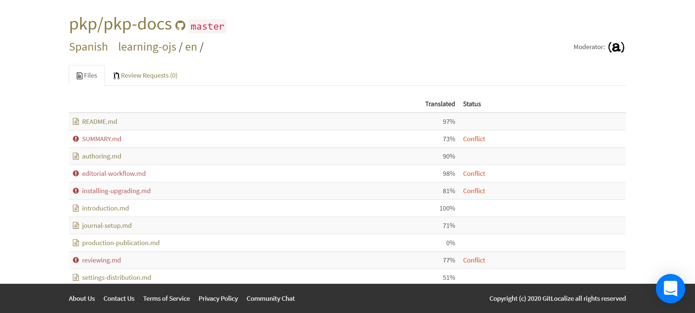

Usually updates will consist of small changes, such as a change to a paragraph, a new paragraph or section, and/or updated screenshots. Sometimes changes will be larger, like a new chapter or substantial changes to the text and/or screenshots. Usually if a document changes substantially, the DIG will release a new version of it and maintain the old version. 

To update the translation, open the guide and find the chapter that needs to be updated, which will not be 100% translated.

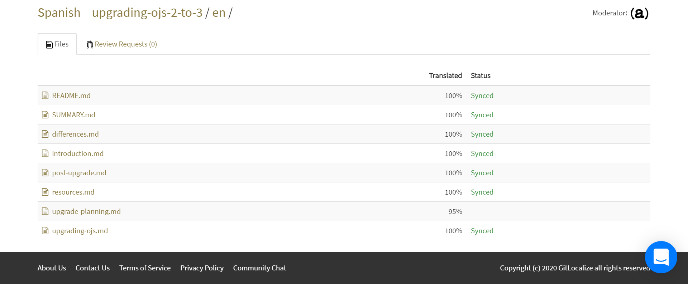

On the right you will see text in the document’s original language that needs to be translated.

Translate that text, using machine translation tools as desired, and click **Submit** below the section when finished.

Click **Create Review Request** when you have finished translating the updates.

### Update a Document Translated Outside of GitLocalize

Some PKP documents were translated before GitLocalize was adopted. These translations have been moved into GitLocalize but the translated segments of text need to be manually connected to the original segments of text. Until the segments are connected, the document will show as having "conflicts." 

To update these translations you can follow the instructions above. Please note that because these documents were translated in the past, there may be a number of significant changes and new segments that need to be translated. 

In addition to updating the translation, you will need to connect any segment tinted red to its original segment. This includes screenshots.

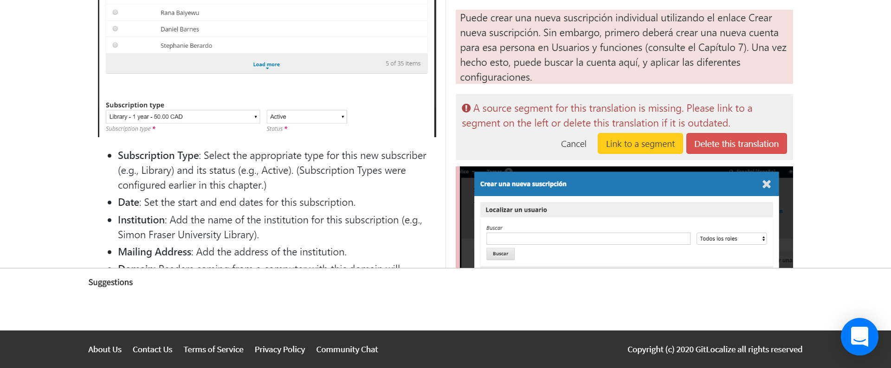

1. Click on the segment highlighted in red
2. You will see a message that says "A source segment for this translation is missing. Please link to a segment on the left or delete this translation if it is outdated." and a button below it to "Link to a segment."
3. Click the **Link to a segment** button. A line will appear.
4. Move to the line to the segment on the left that is the original text of the translated text on the right. Click in the original text segment.

Do this for the rest of the red segments on the page.

## Improve a Document Translation

If a document has already been translated but you think the translation needs to be improved, you can edit an existing translation. 

Follow the instructions above under [Start Translating](#start-translating). The translated text will appear on the right. 

You can edit any section that needs improvement and click **Submit** as you finish the section. 

When you are finished, follow the instructions under **Create Review Request**.

## Translate without GitLocalize

If you do not want to use GitLocalize to translate PKP documentation, your other option is to translate the markdown files, maintaining markdown formatting, and submit your translation directly in the [pkp-docs repository](https://github.com/pkp/pkp-docs) in GitHub. Please note, this method is less preferred because the translation will need to be pulled into GitLocalize and the Translation Coordinator or a future translator will have to manually associate each translated segment of text with the original text.

To understand how documents in pkp-docs are structured and how to create and edit documents, read the [Guidelines for Contributing to PKP Documentation](/contributing/en/).

You can look at the structure of an already translated document, such as Learning OJS, to see how a GitHub-based translation will work.

## Review a Translation

If you are a Language Moderator and a new translation in that language is completed in GitLocalize, you will receive a notification by email that there is a new translation to review. 

Go to the [PKP Docs GitLocalize site](https://gitlocalize.com/repo/4035). You will be automatically logged in if you are logged in to GitHub. 

Go to the Review Request tab to see the open review request.

Click on the review request to open it. The **Conversation** tab will show any comments the translator made. Go to the second **Translated Texts** tab to view the translation. 

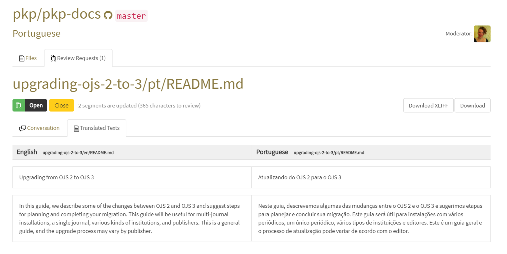

If you want to suggest changes to the translator or ask a question, reply in the Conversation tab. If you are happy with the translation, you can go back to the Conversation tab and click Send Pull Request. You will be asked to enter a Title and Description for your pull request. The title should include the name of the file or files that are included in the translation pull request and the language that they were translated into. For example, "French translation of Learning OJS - Website Settings." The Description can be the same or you can add further information as needed.

This will send a pull request to the pkp-docs GitHub repository, to be merged. You will receive an email notification once it is merged. The translation will be available in the Docs Hub the next time the website is built, which could be in a few days or a week.

There is a bug in GitLocalize that will sometimes display a link to "Create Review Request" after you have gone through all of the above steps and there is nothing new to review. If you encounter this, please ignore it.
